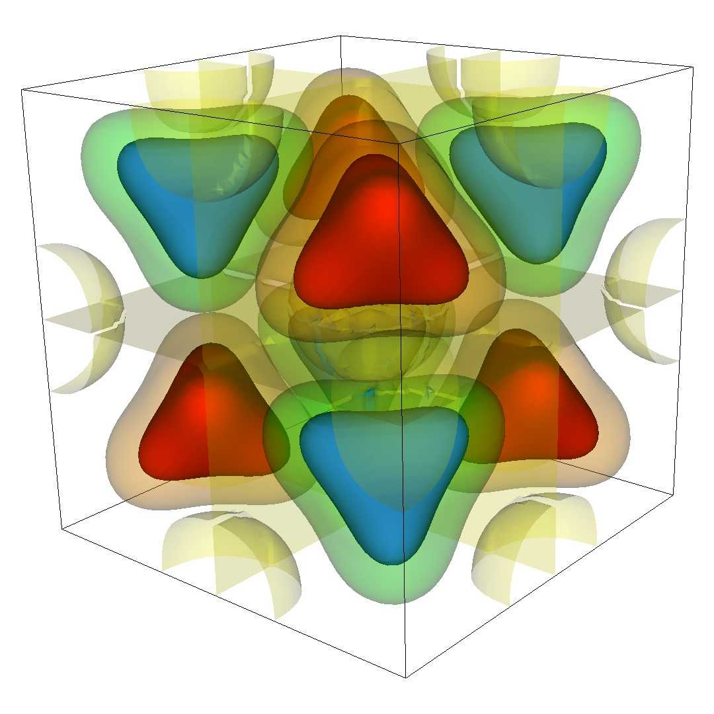

# Algebraic Multigrid

## At a Glance
<!-- (Expected # minutes to complete) %% temporarily omit -->


```
Questions                 |Objectives                           |Key Points
--------------------------|----------- -------------------------|--------------------------
Why multigrid over CG for |Understand multigrid concept         |Faster convergence,
large problems?           |                                     |better scalability
Why use more aggressive   |Understand need for low complexities |Lower memory use, faster
coarsening for AMG?       |                                     |times, but more iterations
Why a structured solver   |Understand importance of suitable    |Higher efficiency,
for a structured problem? |data structures                      |faster solve times
```

**Note:** To begin this lesson...
```
cd handson/amrex/amg
```

## The Problem

The linear system to be solved is generated by AMReX from the following differential equation:


with Dirichlet boundary conditions.

The grid is a cube consisting of 128 x 128 x 128 cells, consisteing of (at least) 8 subgrids.
We also consider a larger grid with 256 x 256 x 256 cells.

The right hand side (left image) and solution (right image) are plotted below:

       


## The Example Input File

To run AMReX with hypre, an input file is required to specify the desired hypre solvers to be used and also allows to define problem options, e.g. grid size, as well as solver options for some of the solvers. The content of the file 'inputs' is given below, although some specific input files are also provided for the handson exercises.

```
n_cell = 128
max_grid_size = 64
tol_rel = 1.e-6

bc_type = Dirichlet  # Dirichlet, Neumann, or periodic

hypre.solver_flag = PFMG-PCG # SMG, or PFMG, SMG-PCG, PFMG-PCG, PCG, BoomerAMG, AMG-PCG, or DS-PCG
hypre.print_level = 1
#hypre.agg_num_levels = 1  # uses aggressive coarsening in BoomerAMG  and AMG-PCG

## Below are some more BoomerAMG options which change
#hypre.relax_type = 6  #uses symmetric Gauss-Seidel smoothing
#hypre.coarsen_type = 8  #uses PMIS coarsening instead of HMIS
#hypre.Pmx_elmts = 6 # changes max nnz per row from 4 to 6 in interpolation
#hypre.interp_type = 0  #uses classified interpolation instead of distance-two interpolation
#hypre.strong_threshold = 0.5 # changes strength threshold
#hypre.max_row_sum = 1.0 # changes treatment of diagonal dominant portions

##Below are some more PFMG options which affect convergence and times
#hypre.pfmg_rap_type = 1 # uses nonGalerkin version for PFMG and PFMG-CG
#hypre.skip_relax = 0 # skips some relaxations in PFMG and PFMG-CG

```

## Running the Example

### Exercise 1: Compare a generic iterative solver (CG) with multigrid

Use the following command to solve our problem using conjugate gradient (CG):
```
/usr/bin/time -p mpiexec -n 8 ./amrex pcg
```

You should get some output that looks like this
```
MPI initialized with 8 MPI processes

213 Hypre Solver Iterations, Relative Residual 9.6515871445080283e-07

Max-norm of the error is 0.0002812723371
Maximum absolute value of the solution is 0.9991262625
Maximum absolute value of the rhs is 1661.007274
real 3.46
user 21.75
sys 1.07
```

Now we solve the same problem using PFMG, the structured multigrid solver from hypre:
```
/usr/bin/time -p mpiexec -n 8 ./amrex pfmg
```

You should get some output that looks like this
```
MPI initialized with 8 MPI processes

22 Hypre Solver Iterations, Relative Residual 8.2557612429588765e-07

Max-norm of the error is 0.0002812747961
Maximum absolute value of the solution is 0.9991262625
Maximum absolute value of the rhs is 1661.007274
real 1.47
user 8.72
sys 0.99
```
#### Examining Results

Examine the number of iterations and the time listed in the line starting with 'real' for both runs.

#### Questions

> **How do the numbers of iterations compare?**

|<font color="white">PFMG converges much faster, almost 10 times as fast</font>|

> **How do the times compare?**

|<font color="white">PFMG is more than twice as fast</font>|

> **What does this say about the cost of an iteration for CG compared to PFMG?**

|<font color="white">One iteration of PFMG is more costly than one CG iteration.</font>|


### Example 2 (Use PFMG as a preconditioner for CG)

Now use the following command:
```
/usr/bin/time -p mpiexec -n 8 ./amrex pfmgpcg
```

You should get some output that looks like this
```
MPI initialized with 8 MPI processes

10 Hypre Solver Iterations, Relative Residual 4.7155525002784425e-07

Max-norm of the error is 0.0002813010027
Maximum absolute value of the solution is 0.9991262625
Maximum absolute value of the rhs is 1661.007274
real 1.23
user 6.73
sys 0.98
```

#### Questions

> **How does the number of iterations compare to that of PFMG without CG?**

|<font color="white">PFMG with PCG converges about twice as fast as PFMG, 22 times as fast as CG.</font>|

> **How do the times compare?**

|<font color="white">PFMG-PCG is faster than PFMG alone. It is almost 3 times as fast as CG.</font>|

> **What does this say about the cost of an iteration for PFMG-PCG compared to PFMG?**

|<font color="white">One iteration of PFMG-PCG is more costly than one PFMG iteration.</font>|

Since using multigrid in combination with CG is faster than multigrid alone for the considered problem, we now only consider multigrid solvers in combination with CG for the sake of time in the hands-on exercises.

### Example 3 (Examine scalability of CG compared with PFMG-CG)

We now solve the larger problem using first CG and then PFMG-PCG.

Now use the following command:
```
/usr/bin/time -p mpiexec -n 8 ./amrex pcg.large
```

You should get some output that looks like this
```
MPI initialized with 8 MPI processes

440 Hypre Solver Iterations, Relative Residual 9.9740013439759751e-07

Max-norm of the error is 7.039397221e-05
Maximum absolute value of the solution is 0.9997778176
Maximum absolute value of the rhs is 1663.462965
real 42.25
user 333.29
sys 2.47
```

Now use the following command:
```
/usr/bin/time -p mpiexec -n 8 ./amrex pfmgpcg.large
```

You should get some output that looks like this
```
MPI initialized with 8 MPI processes

11 Hypre Solver Iterations, Relative Residual 2.5598385447572329e-07

Max-norm of the error is 7.041558516e-05
Maximum absolute value of the solution is 0.9997778176
Maximum absolute value of the rhs is 1663.462965
real 7.15
user 52.28
sys 2.93
```

#### Examining Results

> **How do the numbers of iterations now compare?**

|<font color="white">Iterations for PCG doubled, whereas PFMG-PCG only increased by 1. PFMG-PCG converges 40 times as fast as PCG.</font>|

> **How do the times compare?**

|<font color="white">PFMG-PCG is almost 6 times as fast as PCG.</font>|

> **If you compare these numbers to the numbers for the smaller system, what do you observe?**

|<font color="white">Times and iterations for PCG grow much faster than for PFMG-PCG with increasing problem size. PFMG-PCG is more scalable than PCG.</font>|


### Example 4 (Examine complexities in AMG-PCG)

We now go back to the smaller problem using AMG-PCG.

Now use the following command:
```
/usr/bin/time -p mpiexec -n 8 ./amrex amgpcg
```

You should get some output that looks like this
```
MPI initialized with 8 MPI processes

 Num MPI tasks = 8

 Num OpenMP threads = 1


BoomerAMG SETUP PARAMETERS:

 Max levels = 25
 Num levels = 8

 Strength Threshold = 0.250000
 Interpolation Truncation Factor = 0.000000
 Maximum Row Sum Threshold for Dependency Weakening = 0.900000

 Coarsening Type = HMIS
 measures are determined locally


 No global partition option chosen.

 Interpolation = extended+i interpolation

Operator Matrix Information:

            nonzero         entries per row        row sums
lev   rows  entries  sparse  min  max   avg       min         max
===================================================================
 0 2097152 14581760  0.000     4    7   7.0   1.000e-03   9.830e+05
 1 1048122 19632610  0.000     7   42  18.7   1.998e-03   1.229e+06
 2  199271  9681535  0.000    15   89  48.6   4.627e-03   1.397e+06
 3   27167  2149919  0.003    17  140  79.1   2.503e-02   1.491e+06
 4    3504   306430  0.025    13  185  87.5   3.300e-01   2.597e+06
 5     458    32358  0.154    11  175  70.7   1.164e+00   7.021e+06
 6      61     2375  0.638    10   60  38.9  -1.998e+09   7.281e+09
 7       6       36  1.000     6    6   6.0   9.485e+06   7.651e+07

Interpolation Matrix Information:
                 entries/row    min     max         row sums
lev  rows cols    min max     weight   weight     min       max
=================================================================
 0 2097152 x 1048122   1   4   1.111e-01 4.631e-01 3.333e-01 1.000e+00
 1 1048122 x 199271   1   4   3.236e-03 5.927e-01 1.070e-01 1.000e+00
 2 199271 x 27167   0   4  -1.101e-01 7.178e-01 0.000e+00 1.000e+00
 3 27167 x 3504    0   4  -5.812e-01 6.900e-01 0.000e+00 1.000e+00
 4  3504 x 458     0   4  -3.235e+01 6.382e+01 0.000e+00 1.000e+00
 5   458 x 61      0   4  -3.563e+01 1.590e+01 -3.338e+01 1.000e+00
 6    61 x 6       0   3   2.779e-03 5.764e-01 0.000e+00 1.012e+00


     Complexity:    grid = 1.609679
                operator = 3.181168
                memory = 3.843933


BoomerAMG SOLVER PARAMETERS:

  Maximum number of cycles:         1
  Stopping Tolerance:               0.000000e+00
  Cycle type (1 = V, 2 = W, etc.):  1

  Relaxation Parameters:
   Visiting Grid:                     down   up  coarse
            Number of sweeps:            1    1     1
   Type 0=Jac, 3=hGS, 6=hSGS, 9=GE:     13   14     9
   Point types, partial sweeps (1=C, -1=F):
                  Pre-CG relaxation (down):   0
                   Post-CG relaxation (up):   0
                             Coarsest grid:   0


10 Hypre Solver Iterations, Relative Residual 6.9077383873163803e-07

Max-norm of the error is 0.0002813125533
Maximum absolute value of the solution is 0.9991262625
Maximum absolute value of the rhs is 1661.007274
real 4.63
user 33.54
sys 1.47
```

This output gives the stats for the developed AMG preconditioner. It shows the number of levels, the average number of nonzeros in total and per row for each matrix

as well as each interpolation operator.
It also shows the operator complexity, which is defined as the sum of the number of nonzeroes of all operators

divided by the number of nonzeroes of the original matrix _A_ =
 :

.

The memory complexity also includes the number of nonzeroes of all interpolation operators in the sum:


#### Questions

> **Is the operator complexity acceptable?**

|<font color="white">No, it is too large, above 2!</font>|

> **How does the complexity affect performance?**

|<font color="white">The method is slower than PFMG-PCG and even PCG, inspite of a low number of iterations.</font>|

Now, let us use AMG-PCG with aggressive coarsening turned on for the first level.

```
/usr/bin/time -p mpiexec -n 8 ./amrex amgpcg2
```

You should get some output that looks like this
```
MPI initialized with 8 MPI processes
 Num OpenMP threads = 1


BoomerAMG SETUP PARAMETERS:

 Max levels = 25
 Num levels = 7

 Strength Threshold = 0.250000
 Interpolation Truncation Factor = 0.000000
 Maximum Row Sum Threshold for Dependency Weakening = 0.900000

 Coarsening Type = HMIS

 No. of levels of aggressive coarsening: 1

 Interpolation on agg. levels= multipass interpolation
 measures are determined locally


 No global partition option chosen.

 Interpolation = extended+i interpolation

Operator Matrix Information:

            nonzero         entries per row        row sums
lev   rows  entries  sparse  min  max   avg       min         max
===================================================================
 0 2097152 14581760  0.000     4    7   7.0   1.000e-03   9.830e+05
 1  168473  3001117  0.000     9   36  17.8   1.196e-02   1.835e+06
 2   36380  1786702  0.001    15   93  49.1   4.442e-02   3.245e+06
 3    4862   345260  0.015    15  146  71.0   2.634e-01   5.022e+06
 4     674    46930  0.103    14  184  69.6   1.035e+00   1.199e+07
 5      84     3542  0.502    13   74  42.2   2.600e+06   5.014e+07
 6       7       49  1.000     7    7   7.0   6.754e+06   2.370e+07


Interpolation Matrix Information:
                 entries/row    min     max         row sums
lev  rows cols    min max     weight   weight     min       max
=================================================================
 0 2097152 x 168473   1   9   1.055e-02 1.000e+00 1.220e-01 1.000e+00
 1 168473 x 36380   1   4   3.841e-03 1.000e+00 1.630e-01 1.000e+00
 2 36380 x 4862    0   4  -4.129e-03 1.000e+00 0.000e+00 1.000e+00
 3  4862 x 674     0   4  -1.383e-01 6.712e-01 0.000e+00 1.000e+00
 4   674 x 84      0   4  -6.354e-01 6.935e-01 0.000e+00 1.000e+00
 5    84 x 7       0   4  -2.982e-02 1.394e-01 0.000e+00 1.000e+00


     Complexity:    grid = 1.100365
                operator = 1.355485
                memory = 1.707254


BoomerAMG SOLVER PARAMETERS:
  Maximum number of cycles:         1
  Stopping Tolerance:               0.000000e+00
  Cycle type (1 = V, 2 = W, etc.):  1

  Relaxation Parameters:
   Visiting Grid:                     down   up  coarse
            Number of sweeps:            1    1     1
   Type 0=Jac, 3=hGS, 6=hSGS, 9=GE:     13   14     9
   Point types, partial sweeps (1=C, -1=F):
                  Pre-CG relaxation (down):   0
                   Post-CG relaxation (up):   0
                             Coarsest grid:   0


13 Hypre Solver Iterations, Relative Residual 2.6981728821542126e-07

Max-norm of the error is 0.000281305921
Maximum absolute value of the solution is 0.9991262625
Maximum absolute value of the rhs is 1661.007274
real 2.17
user 14.03
sys 1.34
```

#### Questions

> **How does the number of levels change? The complexity?**

|<font color="white">There is one level less. The complexity is much improved, almost 3 times as small, clearly below 2, closer to 1.</font>|

> **How does this affect the performance?**

|<font color="white">The time is more than twice as fast, however convergence is worse.</font>|

> **How does this compare to PFMG-PCG when applied to the same problem? Why?**

|<font color="white">PFMG-PCG is almost twice as fast, even converges slightly faster. PFMG-PCG takes advantage of the structure in the problem, which AMG-PCG cannot do.</font>|


## Out-Brief

We investigated why multigrid methods are preferrable over generic solvers like conjugate gradient for large suitable PDE problems.
Additional improvements can be achieved when using them as preconditioners for Krylov solvers like conjugate gradient.
For unstructured multigrid solvers, it is important to keep complexities low, since large complexitites lead to slow solve times and require much memory.
For structured problems, solvers that take advantage of the structure of the problem are more efficient than unstructured solvers.


### Further Reading

To learn more about algebraic multigrid, see
[An Introduction to Algebraic Multigrid](https://computation.llnl.gov/projects/hypre-scalable-linear-solvers-multigrid-methods/CiSE_2006_amg_220851.pdf)

More information on hypre , including documentation and further publications, can be found [here](http://www.llnl.gov/CASC/hypre)

<!-- Insert space, horizontal line, and link to HandsOnLesson table -->

&nbsp;

---

[Back to all HandsOnLessons](../lessons.md)
