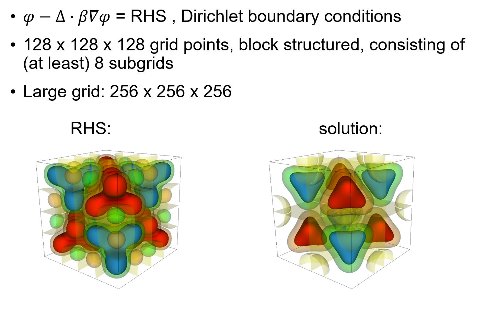

# Algebraic Multigrid

## At A Glance (Expected 10 minutes to complete)


```
Questions                  |Objectives                          |Key Points
---------------------------|------------------------------------|-------------------
Why multigrid over CG for |Understand multigrid concept         |Faster convergence,
large problems?           |                                     |better scalability
Why a structured solver   |Understand importance of suitable    |Faster solve times  
for a structured problem? |data structures                      |
Why use more aggressive   |Understand need for low complexities |Lower memory use, faster
coarsening for AMG?       |                                     |times, but more iterations
```

## The problem being solved

|[] (AMG-problem.png)|


## The Example Source Code

Describe the application, its command-line arguments, have a link to view the actual source code
or, if you prefer, include snipits of the source code here in a code-highlighted box as below

```c++
Geometry::~Geometry()
{
   for (int i = 0; i < NumGeom; i++)
   {
      delete PerfGeomToGeomJac[i];
      delete GeomVert[i];
   }
}
```

## Running the Example

### Run 1 (Problem Name)

Give the command-line to run the example

#### Expected Behavior/Output

Include here what learner should expect to happen

* How long might it take to run
* How long might they have to wait for resources before it can run
* What should they seen on their terminal

#### Examining Results

Include here examples of either plots or data you expect learners to observe.


Or, if you need to control the size, or have multiple images next to each other
use a Markdown table and raw html...

|||

**Note:** You can create [gif animations](https://www.tjhsst.edu/~dhyatt/supercomp/n401a.html)
with ImageMagick tool available on most systems as `convert` command as in...

```
convert -delay 20 -loop 0 image*.<ext> animation.gif
```


Alternatively, you can upload videos to YouTube and embed them here 

<iframe width="560" height="315" src="https://www.youtube.com/embed/bsSFYrDXK0k" frameborder="0" allowfullscreen></iframe>

#### Questions

> **Question #1?** (triple-click box below to reveal answer)

|<font color="white">Answer to Question #1</font>|

> **Question #2?** (triple-click box below to reveal answer)

|<font color="white">Answer to Question #2</font>|

---

### Run 2 (Problem Name)

#### Expected Behavior/Output

#### Examining Results

Include here examples of either plots or data you expect learners to observe.

#### Questions

> **Question #1?** (triple-click box below to reveal answer)

|<font color="white">Answer to Question #1</font>|

> **Question #2?** (triple-click box below to reveal answer)

|<font color="white">Answer to Question #2</font>|

---

### Run 3

#### Expected Behavior/Output

#### Examining Results

Include here examples of either plots or data you expect learners to observe.

#### Questions

> **Question #1?** (triple-click box below to reveal answer)

|<font color="white">Answer to Question #1</font>|

> **Question #2?** (triple-click box below to reveal answer)

|<font color="white">Answer to Question #2</font>|

---

## Out-Brief

Here, re-emphasize the lesson objectives and key points.

Its fine to go into greater detail about questions or objectives this lesson
did not fully cover.

### Further Reading

Include links to other online sources you might want to include.
