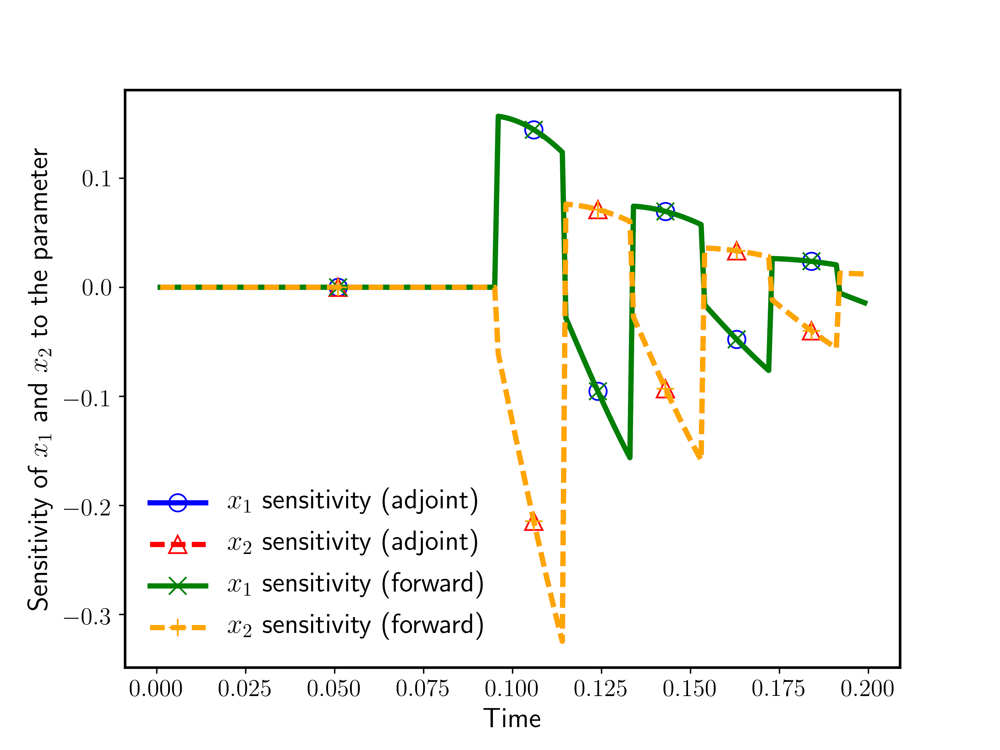
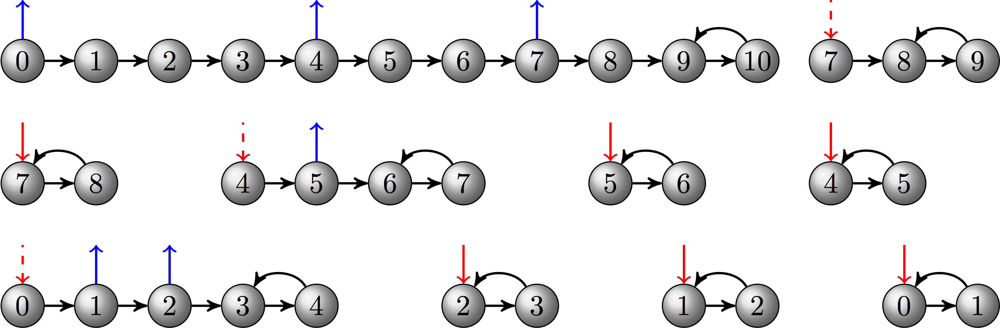

# Using adjoint for optimization

## At a Glance
<!-- (Expected # minutes to complete) %% temporarily omit -->

```
Questions                 |Objectives                     |Key Points
--------------------------|-------------------------------|-------------------------------------
How can gradients be      |Know PETSc/TAO's capability for|Adjoint enables dynamic
computed for simulations? |adjoint and optimization       |constrained optimization.
                          |                               |
How difficult is it to    |Understand ingredients needed  |Jacobian is imperative.
use the adjoint method?   |for adjoint calculation        |
                          |                               |
                          |Understand the concern of      |Performance may depend on
                          |checkpointing                  |checkpointing at large scale.
```

**Note:** To begin this lesson...
```
cd handson/adjoint
```

## Example 1: Generator Stability Analysis:

This code uses [PETSc/TAO](https://www.mcs.anl.gov/petsc/) to demonstrates how to solve an ODE-constrained optimization problem with the Toolkit for Advanced Optimization (TAO), TSEvent, TSAdjoint and TS.
The objective is to maximize the mechanical power input subject to the generator swing equations and a constraint on the maximum rotor angle deviation, which is reformulated as a minimization problem


Disturbance (a fault) is applied to the generator at time 0.1 and cleared at time 0.2.
The objective function contains an integral function.
The gradient is computed with the discrete adjoint of an implicit time stepping method ([Crank-Nicolson](https://en.wikipedia.org/wiki/Crank–Nicolson_method)).

### Compile the code
During ATPESC, participants do not need to compile code because binaries are available in the ATPESC project folder on Cooley. In case you are using your own copy of PETSc, this example is located in `src/ts/examples/power_grid/`. To compile, run the following in the source folder
```
make ex3opt
```
The source code is included in [ex3opt.c](./ex3opt.c)

All the example codes need to compiled only once. Different tasks can be accomplished using command line options.

### Command line options
You can determine the command line options available for this particular example by doing
```
./ex3opt -help
```
and show the options related to TAO only by doing
```
./ex3opt -help | grep tao
```

### Run 1: Monitor the optimization progress

```
./ex3opt -tao_monitor -tao_view
iter =   0, Function value: 2.03778,  Residual: 144.125
iter =   1, Function value: -0.552947,  Residual: 43.1456
iter =   2, Function value: -0.911654,  Residual: 18.3028
iter =   3, Function value: -1.00401,  Residual: 2.48745
iter =   4, Function value: -1.00649,  Residual: 1.17916
iter =   5, Function value: -1.00732,  Residual: 0.125532
iter =   6, Function value: -1.00733,  Residual: 0.00012392
iter =   7, Function value: -1.00733,  Residual: 1.3024e-08
iter =   8, Function value: -1.00733,  Residual: 3.46501e-12
Tao Object: 1 MPI processes
type: blmvm
Gradient steps: 0
TaoLineSearch Object: 1 MPI processes
type: more-thuente
Active Set subset type: subvec
convergence tolerances: gatol=1e-08,   steptol=0.,   gttol=0.
Residual in Function/Gradient:=3.46501e-12
Objective value=-1.00733
total number of iterations=8,                          (max: 2000)
total number of function/gradient evaluations=9,      (max: 4000)
Solution converged:    ||g(X)|| <= gatol
Vec Object: 1 MPI processes
type: seq
1.00793
```
#### Questions
> **Examine the source code and find the user-provided functions for TAO, TS, and TSAdjoint respectively.**

|<font color="white">Essential functions we have provided are FormFunctionGradient for TAO, TSIFunction and TSIJacobian for TS,  RHSJacobianP for TSAdjoint. Because of the integral in the objective function, extra functions including CostIntegrand, DRDYFunction and DRDPFunction are given to TSAdjoint.</font>|

### Further information

A more complicated example for power grid application is in `src/ts/examples/power_grid/stability_9bus/ex9busopt.c`.


## Example 2: Hybrid Dynamical System:

This code demonstrates how to compute the adjoint sensitivity for a complex dynamical system involving discontinuities with TSEvent, TSAdjoint and TS. The dynamics are described by the ODE


where  and the matrix A change from


 when  and switch back  when .

Thus the ODE system alternates the right-hand side when a switching face is encountered. The switching surfaces are given by the algebraic constraints depending on the state variables, as shown below (left)



* The parameter to which the sensitivities are computed is marked in red.
* It represents the slope of the switching surface.
* Intuitively the trajectory cannot be affected before it hits the surface.
* The influence of the perturbation in the slope diminishes as the trajectory is approaching the equilibrium point.

### Compile the code
This example is in `src/ts/examples/hybrid`. The source code is included in [ex1adj.c](./ex1adj.c)

```
make ex1adj
```

### Make the graghics work via interactive mode on cooley
Graphics is tricky. HPC users often do it offline. In order to make it work with cooley, your computer must have X11 (Mac users can install XQuartz). If you do not have it now, just skip the graphics parts since they are not essential.

Apply for an interactive allocation (skip this if you already got one)
```
$ qsub -I -t 60 -n 1 -A <project_name>
```
For example, if my interactive allocation gives me node cc115, open a new terminal and do the following:
```
$ ssh -C -X -Y cooley.alcf.anl.gov
```
```
$ ssh -X cc115
```

### Run 1: Monitor solution graphically with phase diagram

```
./ex1adj -ts_monitor_draw_solution_phase -4,-2,2,2 -draw_pause -2
```

### Run 2: Monitor the timestepping process

```
./ex1adj -ts_monitor
```
Trailing (r) in some lines of the output indicates that a rollback happens. In this example, it is triggered by `TSEvent`. To check  details about the event, we can use the event monitor
```
./ex1adj -ts_monitor -ts_event_monitor
```
We can also monitor the timestepping for the adjoint calculation by doing
```
./ex1adj -ts_monitor -ts_adjoint_monitor
```

### Further information

The example `ex1fwd.c` in the same folder illustrates the forward sensitivity approach for the same problem.


## Example 3: Diffusion-Reaction Problem

This code demonstrates parallel adjoint calculation for a system of time-dependent PDEs on a 2D rectangular grid.
The adjoint solution corresponds to the sensitivities of one component in the final solution w.r.t. the initial conditions.
We will use this example to illustrate the performance considerations for realistic large-scale applications. In particular, we will show how to play with checkpointing and how to profile/tune the performance.

### Compile the code
This example is in `src/ts/examples/advection-diffusion-reaction`. The source code is included in [ex5adj.c](./ex5adj.c)

```
make ex5adj
```

### Run 1: Monitor solution graphically

```
mpiexec -n 4 ./ex5adj -forwardonly -implicitform 0 -ts_type rk \
                     -ts_monitor -ts_monitor_draw_solution
```

* `-forwardonly` perform the forward simulation without doing adjoint
* `-implicitform 0 -ts_type rk` changes the time stepping algorithm to a Runge-Kutta method
* `-ts_monitor_draw_solution` monitors the progress for the solution at each time step
* Add `-draw_pause -2` if you want to pause at the end of simulation to see the plot

### Run 2: Optimal checkpointing schedule
By default, the checkpoints are stored in binary files on disk. Of course, this may not be a good choice for large-scale applications running on high-performance machines where I/O cost is significant. We can make the solver use RAM for checkpointing and specify the maximum allowable checkpoints so that an optimal adjoint checkpointing schedule that minimizes the number of recomputations will be generated.

```
mpiexec -n 4 ./ex5adj -implicitform 0 -ts_type rk -ts_adapt_type none \
                     -ts_max_steps 10 -ts_monitor -ts_adjoint_monitor \
                     -ts_trajectory_type memory -ts_trajectory_max_cps_ram 3 \
                     -ts_trajectory_monitor -ts_trajectory_view
```
The output corresponds to the schedule depicted by the following diagram:



#### Questions
> **What will happen if we add the option `-ts_trajectory_max_cps_disk 2` to specify there are two available slots for disk checkpoints?**

|<font color="white">Looking at the output, we will find that the new schedule uses both RAM and disk for checkpointing and takes two less recomputations.</font>|

### Run 3: Implicit time integration method
Now we switch to an implicit method ([Crank-Nicolson](https://en.wikipedia.org/wiki/Crank–Nicolson_method)) using fixed stepsize, which is the default setting in the code. At each time step, a nonlinear system is solved by the PETSc nonlinear solver `SNES`.
```
mpiexec -n 12 ./ex5adj -da_grid_x 1024 -da_grid_y 1024 -ts_max_steps 10 -snes_monitor -log_view -ts_monitor
```
* `-snes_monitor` shows the progress of `SNES`
* `-log_view` prints a summary of the logging

A snippet of the summary:
```
...
Phase summary info:
   Count: number of times phase was executed
   Time and Flop: Max - maximum over all processors
                   Ratio - ratio of maximum to minimum over all processors
   Mess: number of messages sent
   Avg. len: average message length (bytes)
   Reduct: number of global reductions
   Global: entire computation
   Stage: stages of a computation. Set stages with PetscLogStagePush() and PetscLogStagePop().
      %T - percent time in this phase         %F - percent flop in this phase
      %M - percent messages in this phase     %L - percent message lengths in this phase
      %R - percent reductions in this phase
   Total Mflop/s: 10e-6 * (sum of flop over all processors)/(max time over all processors)
------------------------------------------------------------------------------------------------------------------------
Event                Count      Time (sec)     Flop                             --- Global ---  --- Stage ---   Total
                   Max Ratio  Max     Ratio   Max  Ratio  Mess   Avg len Reduct  %T %F %M %L %R  %T %F %M %L %R Mflop/s
------------------------------------------------------------------------------------------------------------------------

--- Event Stage 0: Main Stage

VecDot                20 1.0 2.7505e-02 1.7 7.00e+06 1.0 0.0e+00 0.0e+00 2.0e+01  0  0  0  0  2   0  0  0  0  2  3050
VecMDot              321 1.0 2.6292e+00 1.4 6.62e+08 1.0 0.0e+00 0.0e+00 3.2e+02 25 15  0  0 34  25 15  0  0 34  3017
VecNorm              401 1.0 7.1590e-01 1.9 1.40e+08 1.0 0.0e+00 0.0e+00 4.0e+02  7  3  0  0 42   7  3  0  0 42  2349
...
```

#### Questions
> **Where is the majority of CPU time spent?**

|<font color="white">Of course answer may vary depending on the settings such as number of procs, problem size, and solver options. Typically most of the time should be spent on [VecMDot](http://www.mcs.anl.gov/petsc/petsc-current/docs/manualpages/Vec/VecMDot.html) or [MatMult](http://www.mcs.anl.gov/petsc/petsc-current/docs/manualpages/Mat/MatMult.html) </font>|

> **How expensive is it to do an adjoint step?**

|<font color="white">For this particular run, an adjoint step takes about 70% of the running time of a forward step (compare the time between TSAdjointStep and TSStep). </font>|

> **How can we improve performance?**

|<font color="white">1. Use memory instead of disk for checkpointing(`-ts_trajectory_type memory -ts_trajectory_solution_only 0`); 2. Tune the time stepping solver, nonlinear solver, linear solver, preconditioner and so forth. </font>|

### Further information
Because this example uses `DMDA`, Jacobian can be efficiently approxiated using finite difference with coloring. You can use the option `-snes_fd_color` to enable this feature.

## Out-Brief

We have used [PETSc](https://www.mcs.anl.gov/petsc/) to demonstrate the adjoint capability as an enabling technology for dynamic-constrained optimization. In particular, we focused on time-depdent problems including complex dynamical systems with discontinuities and a large scale hyperbolic PDE.

We have shown the basic usage of the adjoint solver as well as functionalities that can facilitate rapid development, diagnosis and performance profiling.

## Further Reading

[PETSc Documentation](http://www.mcs.anl.gov/petsc/documentation/)

<!-- Insert space, horizontal line, and link to HandsOnLesson table -->

&nbsp;

---

[Back to all HandsOnLessons](../lessons.md)
