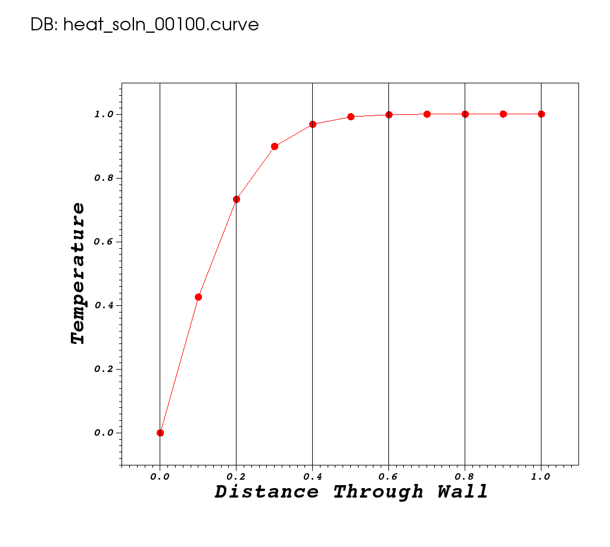
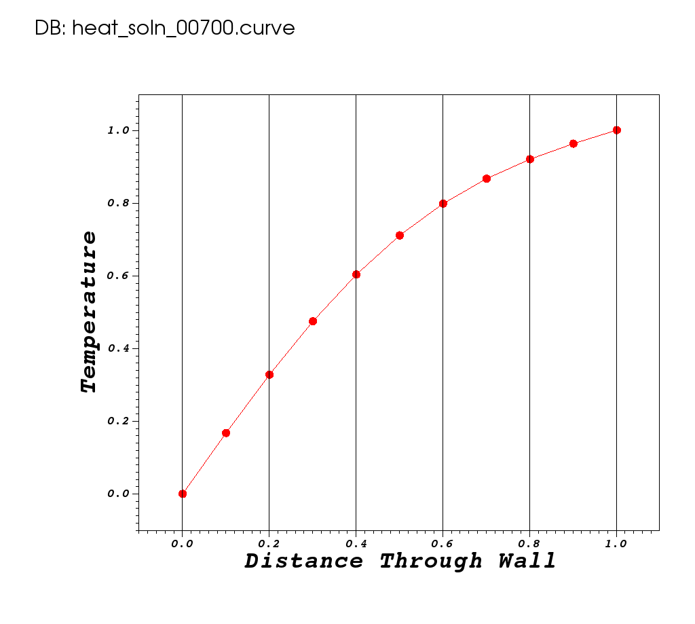

# Hand Coded 1D Heat Equation

## At A Glance (15 mins)

```
Questions                 |Objectives                           |Key Points
--------------------------|-------------------------------------|-------------------------------------
What is a numerical alg.? |Understand performance metrics       |Numerical algs. involve signficant SQE
What is discretization?   |Understand algorithmic trade-offs    |Software packages simplify dev. & use
What is stability?        |Understand value of software packages|
```

## The problem being solved

In this lesson, we use a simple, hand-coded, C application to solve
a few different variations of a one dimensional heat conduction
problem through a homogeneous wall of unit thickness.

|||

* The left boundary at x=0, is held at some constant temperature, bc0, for all time.
* The right boundary at x=1, is held at some constant temperature, bc1, for all time.
* Various initial conditions, u(x) at t=0, may be specified.

We will run the example code with various input parameters and observe the results
as _Curve_ plots in [VisIt](https://visit.llnl.gov) such as the one pictured here

## The Example Source Code

[heat.c](./heat.c)

### Getting help

At any point, you can get help regarding various options the
application supports like so...

```
./[mcmiller@cooleylogin1 ~/tmp]$ ./heat --help
Usage:
    ./heat <arg>=<value> <arg>=<value>...
        prec=double                     precision half|float|double|quad (char*)
        alpha=0.2                          material thermal diffusivity (double)
        dx=0.1                                  x-incriment (1/dx->int) (double)
        dt=0.004                                            t-incriment (double)
        bc0=0                                          bc @ x=0: u(0,t) (double)
        bc1=1                                          bc @ x=1: u(1,t) (double)
        ic=const(1)                                     ic @ t=0: u(x,0) (char*)
        alg=ftcs                          algorithm ftcs|upwind15|crankn (char*)
        eps=1e-06                                 convergence criterion (double)
        maxi=5000                           max. number of time iterations (int)
        savi=0                               save every i-th solution step (int)
        save=0                          save error in every saved solution (int)
        outi=100                  output progress every i-th solution step (int)
        noout=0                                   disable all file outputs (int)
Examples...
    ./heat Nx=51 dt=0.002 alg=ftcs
    ./heat Nx=51 bc0=5 bc1=10
```

### Using Make to Orchestrate Runs

As an aside, we are using make and a [makefile](./makefile.txt) here to help orchestrate
the runs and to help simplify other tasks such as visualizing results. This is because
we are actually running the example code multiple times with different
arguments and tools to obtain various performance details.

### Run 1: Basic Heat Problem

The following command will run the basic heat equation using the
[_explicit_](https://en.wikipedia.org/wiki/Explicit_and_implicit_methods)
[FTCS](https://en.wikipedia.org/wiki/FTCS_scheme)
numerical algorithm method.
In an _explicit_ method, the solution at _any_ point, _x_,
can be computed _entirely_ from knowledge of the values at previous times.
In this example, we have bc0 set to 0, bc1 set to 1 and initial condition
set to a constant of 1 as visualized in the plot of the time-zero setup below.

||

To run the application to solve this problem, the command is...

```
./heat alpha= dx=0.1 dt=0.004 bc0=0 bc1=1 ic="const(1)" alg=ftcs eps=1e-6 maxi=5000 savi=100
```

The following output is observed...

```
    prec=double
    alpha=0.2
    dx=0.1
    dt=0.004
    bc0=0
    bc1=1
    ic=const(1)
    alg=ftcs
    eps=1e-06
    maxi=5000
    savi=100
    save=0
    outi=100
    noout=0
Iteration 0000: last change l2=1
Iteration 0100: last change l2=1.19031e-05
Iteration 0200: last change l2=4.33838e-06
Iteration 0300: last change l2=2.3795e-06
Iteration 0400: last change l2=1.53328e-06
Iteration 0500: last change l2=1.06203e-06
Iteration 0600: last change l2=7.59145e-07
Iteration 0700: last change l2=5.49851e-07
Iteration 0800: last change l2=4.00416e-07
Iteration 0900: last change l2=2.92232e-07
Iteration 1000: last change l2=2.13464e-07
Iteration 1100: last change l2=1.55983e-07
Iteration 1200: last change l2=1.13997e-07
Iteration 1300: last change l2=8.33166e-08
Iteration 1400: last change l2=6.08948e-08
Iteration 1500: last change l2=4.45075e-08
Iteration 1600: last change l2=3.25303e-08
Iteration 1700: last change l2=2.37762e-08
Iteration 1800: last change l2=1.7378e-08
Iteration 1900: last change l2=1.27015e-08
Iteration 2000: last change l2=9.28346e-09
Iteration 2100: last change l2=6.78525e-09
Iteration 2200: last change l2=4.95931e-09
Converged to 3.995e-09 in 2270 iterations
Integer ops        = 4135142
Floating point ops = 255769
Memory used        = 176 bytes
```

Note the total number of iterations, floating point operation count and memory used.

To visualize a short animation of the results this example, you can use the command

```
make PROB=basic view
```

Some of the intermediate results are plotted below.

||||

Now, in viewing the results, we can see that the _grid_ or _mesh_ (circles and lines
in the plots, above, in this example is rather coarse. Suppose we would like to have
10x finer spatial resolution instead of _dx=0.1_, change _dx=0.01_.

### Run 2 Finer Spatial Resolution

```
./heat alpha= dx=0.01 dt= bc0= bc1= ic= alg= eps= maxi= savi=10 save= outi=
    prec=double
    alpha=0.2
    dx=0.01
    dt=0.004
    bc0=0
    bc1=1
    ic=const(1)
    alg=ftcs
    eps=1e-06
    maxi=5000
    savi=10
    save=0
    outi=100
    noout=0
Iteration 0000: last change l2=1
Iteration 0100: last change l2=1.63884e+142
Iteration 0200: last change l2=1.74264e+288
/bin/sh: line 8: 318217 Floating point exception(core dumped) ../heat alpha= dx=0.01 dt= bc0= bc1= ic="" alg= eps= maxi= savi=10 save= outi=
Integer ops        = 4202002
Floating point ops = 472837
Memory used        = 1616 bytes
```

Note the **Floating point exception(core dumped)**.
What happend? We have hit an _instability_ in the [FTCS](https://en.wikipedia.org/wiki/FTCS_scheme) algorithm.
It is known to be stable only when 


We can naively correct for this by shrinking the time-step. Lets try a _dt_ of 0.001

### Run 3 Decrease Time Step To 0.001

```
./heat alpha= dx=0.01 dt=0.001 bc0= bc1= ic= alg= eps= maxi= savi=250 save= outi=250
    prec=double
    alpha=0.2
    dx=0.01
    dt=0.001
    bc0=0
    bc1=1
    ic=const(1)
    alg=ftcs
    eps=1e-06
    maxi=5000
    savi=250
    save=0
    outi=250
    noout=0
Iteration 0000: last change l2=1
Iteration 0250: last change l2=1.59787e-05
Iteration 0500: last change l2=5.6456e-06
Iteration 0750: last change l2=3.07239e-06
Iteration 1000: last change l2=1.99502e-06
Iteration 1250: last change l2=1.42523e-06
Iteration 1500: last change l2=1.07788e-06
Iteration 1750: last change l2=8.43739e-07
Iteration 2000: last change l2=6.74081e-07
Iteration 2250: last change l2=5.44943e-07
Iteration 2500: last change l2=4.43518e-07
Iteration 2750: last change l2=3.62338e-07
Iteration 3000: last change l2=2.96643e-07
Iteration 3250: last change l2=2.43145e-07
Iteration 3500: last change l2=1.99424e-07
Iteration 3750: last change l2=1.63624e-07
Iteration 4000: last change l2=1.34278e-07
Iteration 4250: last change l2=1.10207e-07
Iteration 4500: last change l2=9.04564e-08
Iteration 4750: last change l2=7.42481e-08
Did not converge: residual = 6.099e-08 after 5000 iterations
Integer ops        = 16358485
Floating point ops = 5511563
Memory used        = 1616 bytes
```

Note the **Did not converge**. The solution has yet to converge to the desired tolerance.
In order to correct for that, we need to let it run longer. Lets try a maximum of 20,000
iterations

### Run 4 Increase Maximum Iterations

```
./heat alpha= dx=0.01 dt=0.001 bc0= bc1= ic= alg= eps= maxi=20000 savi=250 save= outi=250
    prec=double
    alpha=0.2
    dx=0.01
    dt=0.001
    bc0=0
    bc1=1
    ic=const(1)
    alg=ftcs
    eps=1e-06
    maxi=20000
    savi=250
    save=0
    outi=250
    noout=0
Iteration 0000: last change l2=1
Iteration 0250: last change l2=1.59787e-05
Iteration 0500: last change l2=5.6456e-06
Iteration 0750: last change l2=3.07239e-06
Iteration 1000: last change l2=1.99502e-06
Iteration 1250: last change l2=1.42523e-06
Iteration 1500: last change l2=1.07788e-06
Iteration 1750: last change l2=8.43739e-07
Iteration 2000: last change l2=6.74081e-07
Iteration 2250: last change l2=5.44943e-07
Iteration 2500: last change l2=4.43518e-07
Iteration 2750: last change l2=3.62338e-07
Iteration 3000: last change l2=2.96643e-07
Iteration 3250: last change l2=2.43145e-07
Iteration 3500: last change l2=1.99424e-07
Iteration 3750: last change l2=1.63624e-07
Iteration 4000: last change l2=1.34278e-07
Iteration 4250: last change l2=1.10207e-07
Iteration 4500: last change l2=9.04564e-08
Iteration 4750: last change l2=7.42481e-08
Iteration 5000: last change l2=6.09451e-08
Iteration 5250: last change l2=5.00262e-08
Iteration 5500: last change l2=4.10637e-08
Iteration 5750: last change l2=3.3707e-08
Iteration 6000: last change l2=2.76683e-08
Iteration 6250: last change l2=2.27115e-08
Iteration 6500: last change l2=1.86427e-08
Iteration 6750: last change l2=1.53029e-08
Iteration 7000: last change l2=1.25614e-08
Iteration 7250: last change l2=1.0311e-08
Iteration 7500: last change l2=8.46379e-09
Iteration 7750: last change l2=6.9475e-09
Iteration 8000: last change l2=5.70286e-09
Iteration 8250: last change l2=4.68119e-09
Iteration 8500: last change l2=3.84256e-09
Iteration 8750: last change l2=3.15416e-09
Iteration 9000: last change l2=2.58909e-09
Iteration 9250: last change l2=2.12526e-09
Iteration 9500: last change l2=1.74452e-09
Iteration 9750: last change l2=1.43199e-09
Iteration 10000: last change l2=1.17545e-09
Converged to 9.998e-10 in 10206 iterations
Integer ops        = 30217136
Floating point ops = 11249034
Memory used        = 1616 bytes
```

Ok, after going to a finer spatial resolution, the algorithm went unstable. To correct
that, we shrunk the time-step and the algorithm failed to converge to desired tolerance
in 5000 iterations.  Now, we've increased the maximum number of iterations and we finally
have a good result from [FTCS](https://en.wikipedia.org/wiki/FTCS_scheme) algorithm a
finer spatial resolution.

Note the difference in memory between this and run 1 of 176 vs 1616 bytes.
This is the difference between a _mesh_ of 11 nodes (and 10 zones) and a
mesh of 101 nodes (and 100 zones). This is expected. But, also note
the difference in total number of floating point operations to get equivalent
result on finer mesh...255769 for the coarse mesh and 11249034 for the 10x fine
mesh. That is a cost of 43x the floating point work!!! Lets see if we can do
better with a different algorithm.

### Run 5 Switch to Implicit Method ([Crank-Nicolson](https://en.wikipedia.org/wiki/Crank–Nicolson_method))

In this run, we switch the algorithm to an
[_implicit_](https://en.wikipedia.org/wiki/Explicit_and_implicit_methods) method known as the
[_Crank-Nicolson_](https://en.wikipedia.org/wiki/Crank–Nicolson_method)
method. In an _implicit_ method, the solution at any point, _x_, is a linear system of
equations involving other points, _x_, at the current time as well as solution(s) from 
previous times. So, each time step involves the solution of a linear system of equations.

```
./heat alpha= dx=0.01 dt= bc0= bc1= ic= alg=crankn eps= maxi= savi=50 save= outi=
    prec=double
    alpha=0.2
    dx=0.01
    dt=0.004
    bc0=0
    bc1=1
    ic=const(1)
    alg=crankn
    eps=1e-06
    maxi=5000
    savi=50
    save=0
    outi=100
    noout=0
Iteration 0000: last change l2=1
Iteration 0100: last change l2=0.000272086
Iteration 0200: last change l2=5.43757e-05
Iteration 0300: last change l2=1.12768e-05
Iteration 0400: last change l2=2.3395e-06
Iteration 0500: last change l2=4.85357e-07
Iteration 0600: last change l2=1.00693e-07
Iteration 0700: last change l2=2.089e-08
Iteration 0800: last change l2=4.33389e-09
Converged to 3.944e-09 in 807 iterations
Integer ops        = 7495923
Floating point ops = 975755
Memory used        = 4047 bytes
```

Look at how quickly this algorithm converges. Here we've used only 975755 flops. That
is only about 4x as many flops as the [FTCS](https://en.wikipedia.org/wiki/FTCS_scheme)
algorithm used on the **coarse** mesh!! On
the other hand, look at how much additional memory this algorithm required. This is
the memory required to store a _banded_ matrix for the
[implicit](https://en.wikipedia.org/wiki/Explicit_and_implicit_methods) solve. It is about
3x as much memory (for main diagonal and two sub-diagonals) over the FTCS method.

Can we make [Crank-Nicolson](https://en.wikipedia.org/wiki/Crank–Nicolson_method)
go faster by increasing the timestep?

### Run 6 Bigger Time-Step with [Crank-Nicolson](https://en.wikipedia.org/wiki/Crank–Nicolson_method)

```
[mcmiller@cooleylogin1 ~/tmp]$ make crankn_faster
./heat alpha= dx=0.01 dt=0.008 bc0= bc1= ic= alg=crankn eps= maxi= savi=25 save= outi=50
    prec=double
    alpha=0.2
    dx=0.01
    dt=0.008
    bc0=0
    bc1=1
    ic=const(1)
    alg=crankn
    eps=1e-06
    maxi=5000
    savi=25
    save=0
    outi=50
    noout=0
Iteration 0000: last change l2=1
Iteration 0050: last change l2=0.00109878
Iteration 0100: last change l2=0.000220204
Iteration 0150: last change l2=4.59452e-05
Iteration 0200: last change l2=9.59052e-06
Iteration 0250: last change l2=2.00192e-06
Iteration 0300: last change l2=4.17878e-07
Iteration 0350: last change l2=8.72275e-08
Iteration 0400: last change l2=1.82078e-08
Converged to 7.813e-09 in 428 iterations
Integer ops        = 5431250
Floating point ops = 518349
Memory used        = 4047 bytes
```

Here, we have increased the timestep by 2x and yet the
[Crank-Nicolson](https://en.wikipedia.org/wiki/Crank–Nicolson_method) method
converged to similar tolerance in about 1/2 as many floating point operations.

The [Crank-Nicolson](https://en.wikipedia.org/wiki/Crank–Nicolson_method) method
is known to be unconditionally stable. Does that mean we can make time-step
arbitrarily large?

## Out-Brief

We have demonstrated the use of a simple, hand-coded C application to solve
various cases of the heat equation. We have demonstrated some of the issues
to be concerned with in the behavior or numerical algorithms such as time
and space performance and stability.

A simple examination of the C code, [heat.c](./heat.c) demonstrates that in spite of
the over-simplification have done here, developing the code necessary to
impliment numerical algorithms and, in particular, to understand their behavior
is non-trivial. It can get quite complex very quickly. Consider issues with larger
objects, requiring scalable parallel solutions, higher spatial dimensions, unusual
shapes requiring either unstructured or adaptive meshing, higher order and different
types of numerical schemes.

This one of the key values of _numerical packages_. Many of the details of these
issues have been resolved and _vetted_ within the scientific computing community.
Numerical packages can help to simplify the development of highly sophisticated
scientific computing applications and provide a much more solid and flexible
foundation than custom code.

## Further Reading

Apart from time and space performance, _stability_ and _convergence_ there are many other issues
to be concnerned with on numerical algorithms. One issue we don't touch on here is _accuracy_.
Another is making time-step automatically vary based on how the computation is proceeding.

Heat [conduction](https://en.wikipedia.org/wiki/Thermal_conduction) in this simple
one dimensional, cartesian coordinate  case is goverened by the partial differential
equation (PDE)...


and in multiple dimensions and any coordinate system...


where _u_ is the temperature within the wall at positions, _x_, and times, _t_,
 is the _thermal diffusivity_
of the material composition (homogeneous in this simple case) of the wall
and  is the
[Laplace Operator](https://en.wikipedia.org/wiki/Laplace_operator).
This equation is known as the _Diffusion Equation_ and also the
[_Heat Equation_](https://en.wikipedia.org/wiki/Heat_equation)

### Steady State or Variation with Time

In some cases, the only solution we may care about is the _steady state_ solution.
That is the solution for , after a _long, long_ time,
where whatever the initial condition may have been, it's transient effects have died out and all
that is left are the effects due to the constant temperature boundary conditions.
In other cases, we may care about how the temperature varies with time either at a given
point in the wall or throughout the entire width of the wall.

### Analytic Solutions

In some cases, it is possible to define the problem such that there exist an
_analytic_ solution either for a given time or for all time. That is, an
_exact_ solution that can be written down as a mathematical formula.
These cases are attractive because they allow us to assess the accuracy of
our implementation of any numerical algorithm. 

For example, the analytic solution, _u(x,t)_,
for _steady state_, , is
a simple linear interpolation between temperature values at the ends...


### Solving One-Dimensional PDEs with Microsoft Excel

[Microsoft Excel can be used as a powerful way to play with and visualize
results from _explicit_ numerical algorithms.](http://www.math.ubc.ca/~costanza/HeatEqTutorial.html)

[An example Excel spreadsheet is available.](1d_heat_equation.xlsx)
