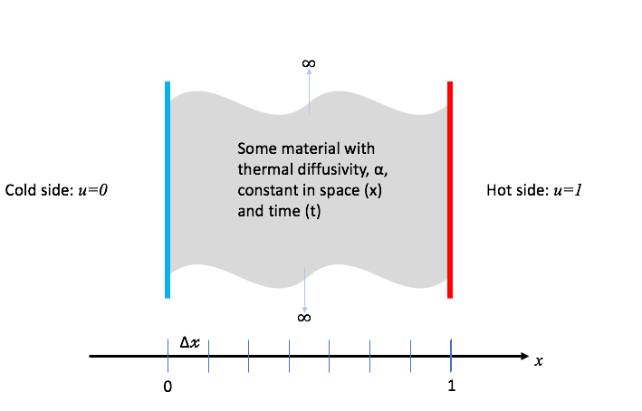
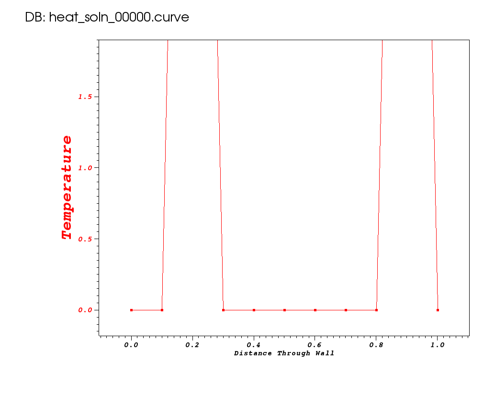
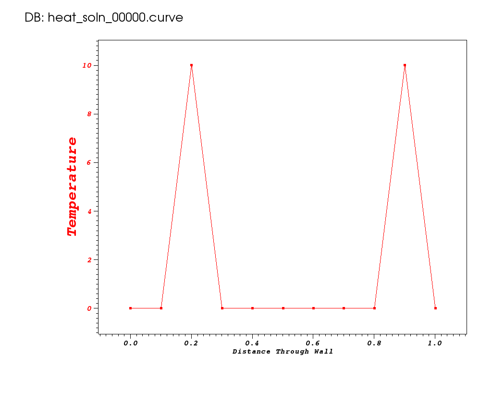
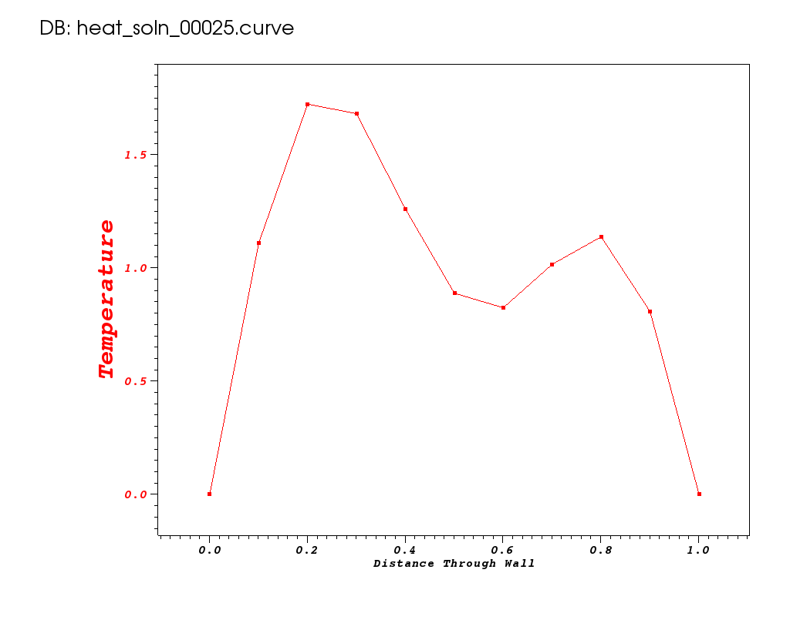
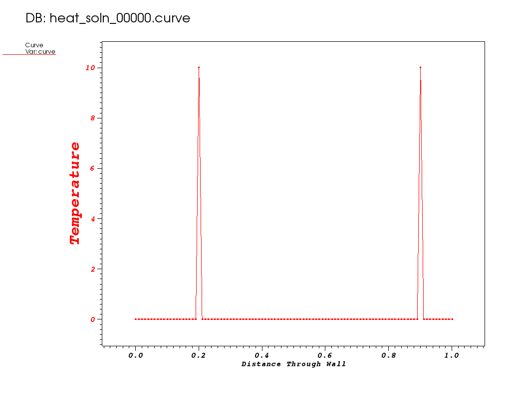
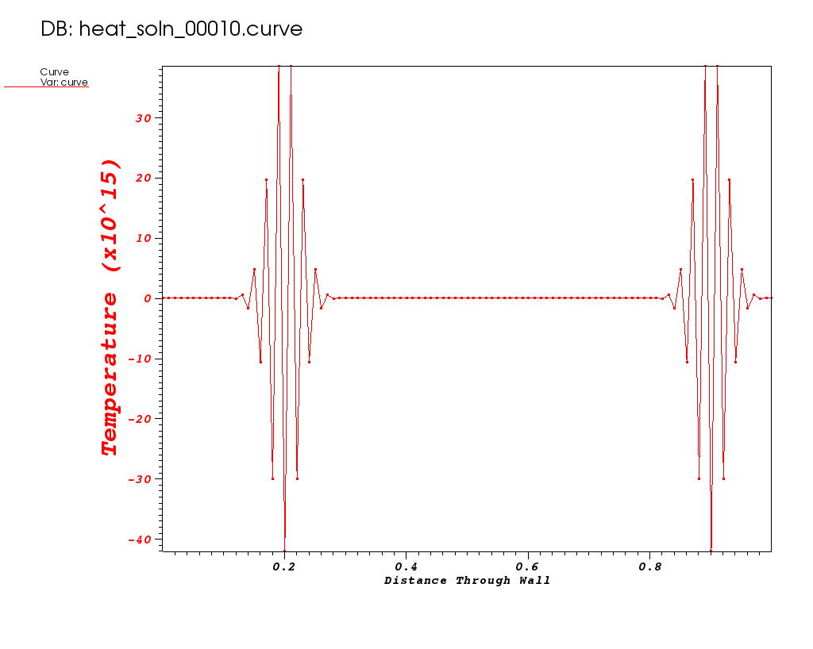
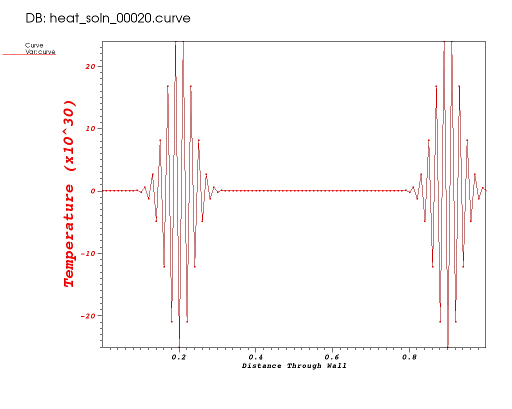
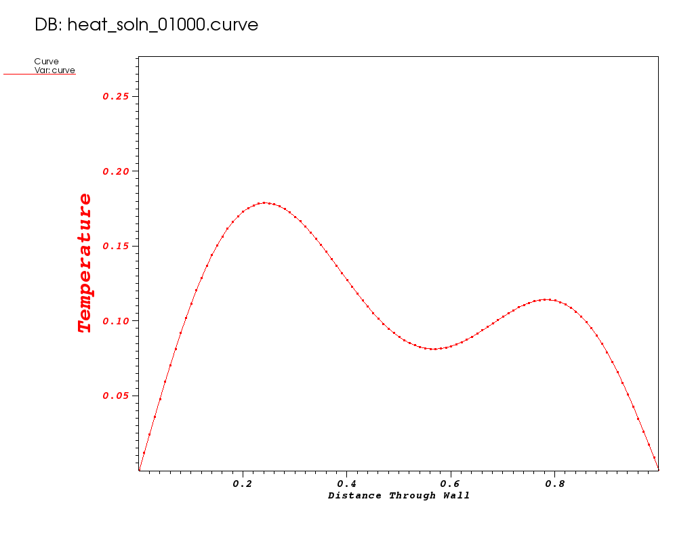
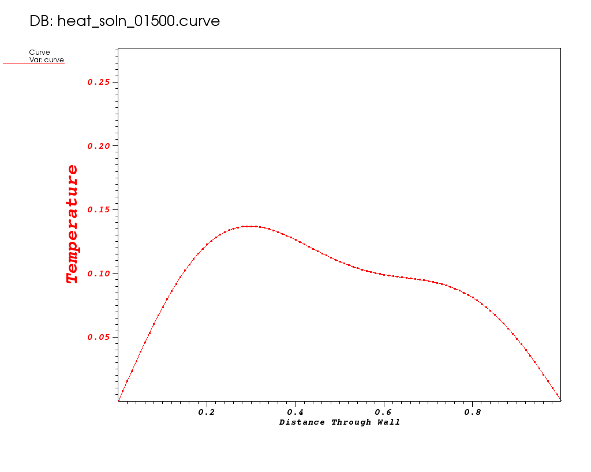

# Hand Coded 1D Heat Equation

*** To reveal answers to the questions throughout this lesson, triple-click on the answer box.

## At A Glance (15 mins)

```
Questions                 |Objectives                           |Key Points
--------------------------|-------------------------------------|-------------------------------------
What is a numerical alg.? |Understand performance metrics       |HPC numerical software involves complex
                          |                                     |algorithms and data structures.
                          |                                     |
What is discretization?   |Understand algorithmic trade-offs    |Robust software requires significant 
                          |                                     |software quality engineering (SQE).
                          |                                     |
What is stability?        |Understand value of software packages|Numerical packages simplify app development,
                          |                                     |provide efficient & scalable performance,
                          |                                     |and enable app-specific customization.
```

## A Real-World Heat Problem

In this lesson, we demonstrate the design and use of a hand-coded
(e.g., does not use any software packages) C-language application to
model _heat_ conduction through a wall as pictured here ...

|[](simple_1d_heat.png)|[](spikes_animated.gif)

### Governing Equations

In general, heat [conduction](https://en.wikipedia.org/wiki/Thermal_conduction) is goverened
by the partial differential (PDE)...

||(1)|

where _u_ is the temperature within the wall at spatial positions, _x_, and times, _t_,
 is the _thermal diffusivity_
of the material(s) comprising the wall and 
is the [Laplace Operator](https://en.wikipedia.org/wiki/Laplace_operator).
This equation is known as the _Diffusion Equation_ and also the
[_Heat Equation_](https://en.wikipedia.org/wiki/Heat_equation).

---

### Simplifying Assumptions

To make the problem tractible for this lesson, we make some simplifying assumptions...

1. The thermal diffusivity, ,
   is constant for all _space_ and _time_.
1. The only heat _source_ is from the initial and/or boundary conditions.
1. We will deal only with the _one dimensional_ problem in _Cartesian coordinates_.

In this case, the PDE we need to develop an application to solve simplifies to...

||(2)|

---

### Scienitifc Inquiries

We want the application we develop to be useful in various scientific inquries
such as...

1. Will the temperature at _x=A_ exceed a given value?
1. How does the maximum temperature in the wall change with time?
1. At what time will temperature fluxuations of frequency, _f_ fall below a threshold?

To answer questions such as these, the application needs to be designed so that it can
properly model _time varying_ or _transient_ behavior of heat conduction and not just
[_thermal equilibrium_](https://en.wikipedia.org/wiki/Thermal_equilibrium).

---

### Some Key Design Choices

1. Do we care only about the _steady state_ or do we also care about
   the _time varying_ or _transient_ solution?
1. The PDE in equation 2 is a _continuous_ equation in two
   [_independent variables_](https://en.wikipedia.org/wiki/Partial_differential_equation)
   _x_ and _t_? How will we [_discretize_](https://en.wikipedia.org/wiki/Discretization)
   the PDE such that its solution can be implemented in a computer program?
1. How do we develop the software so that enhancing it to accomodate more complex
   situations later is easy?

## The Application Source Code

### FTCS Discretization

Consider discretizing, independently, the left- and right-hand sides of
equation 2. For the left-hand side, we can approximate the first derivative
of _u_ with respect to time, _t_, by the equation...

||(3)|

As well, we can approximate the right-hand side of equation 2 with
the second derivative of _u_ with respect to space, _x_, by the equation...

||(4)|

Setting equations 4 and 5 equal to each other and re-arranging terms, we
arrive at the following update scheme for producing the temperatures at
the next time, _k+1_, from temperatures at the current time, _k_, as

||(6)|

where 
Note that all the values on the left-hand side of equation 6 are for time, _k-1_, the
solution from a _previously known_ time-step. Such a method is known as an _explicit_
numerical method. Explicit methods have some nice properties:

* They are easy to implement.
* They typically require minimal memory.
* They are easy to parallelize.

The code to implement this numerical method is shown below.

```c
static void
solution_update_ftcs(int n,
    double *curr, double const *last,
    double alpha, double dx, double dt,
    double bc_0, double bc_1)
{
    double const r = alpha * dt / (dx * dx);

    /* Impose boundary conditions for solution indices i==0 and i==n-1 */
    curr[0  ] = bc_0;
    curr[n-1] = bc_1;

    /* Update the solution using FTCS algorithm */
    for (int i = 1; i < n-1; i++)
        curr[i] = r*last[i+1] + (1-2*r)*last[i] + r*last[i-1];
}
```

The FTCS update method is implemented around line 360 in the example application, [heat.c](heat.c.numbered.txt).

### Getting Help

At any point, you can get help regarding various options the
application supports like so...

```
$ ./heat --help
Usage:
    ./heat <arg>=<value> <arg>=<value>...
        prec=double                     precision half|float|double|quad (char*)
        alpha=0.2                          material thermal diffusivity (double)
        dx=0.1                                  x-incriment (1/dx->int) (double)
        dt=0.004                                            t-incriment (double)
        maxt=2                           max. time to run simulation to (double)
        bc0=0                                          bc @ x=0: u(0,t) (double)
        bc1=1                                          bc @ x=1: u(1,t) (double)
        ic=const(1)                                     ic @ t=0: u(x,0) (char*)
        alg=ftcs                          algorithm ftcs|upwind15|crankn (char*)
        savi=0                               save every i-th solution step (int)
        save=0                          save error in every saved solution (int)
        outi=100                  output progress every i-th solution step (int)
        noout=0                                   disable all file outputs (int)
Examples...
    ./heat dx=0.01 dt=0.0002 alg=ftcs
    ./heat dx=0.1 bc0=5 bc1=10 ic="spikes(5,5)"
```

### Run 1

Let's use this method to model the time evolution of heat from the initial
condition pictured here...

|[](spikes0000.png)|

to a maximum time of 2 seconds.

```
make basic_spikes
./heat bc1=0 ic="spikes(10,2,10,9)" savi=25
    prec=double
    alpha=0.2
    dx=0.1
    dt=0.004
    maxt=2
    bc0=0
    bc1=0
    ic=spikes(10,2,10,9)
    alg=ftcs
    savi=25
    save=0
    outi=100
    noout=0
Iteration 0000: last change l2=7.04
Iteration 0100: last change l2=0.00021002
Iteration 0200: last change l2=4.25035e-05
Iteration 0300: last change l2=8.81977e-06
Iteration 0400: last change l2=1.83059e-06
Iteration 0500: last change l2=3.8597e-07
Integer ops        = 3285657
Floating point ops = 50310
Memory used        = 194 bytes
```

Take note of number of flops and memory used so we can compare these
metrics to other runs later.

> **Are the results correct? How would we assess that?**

|<font color="white">Writing custom code often also requires additional work to vett the results obained, whereas relying upon mature community adopted software packages often means results those packages produce have already been well vetted in many regimes of interest.</font>|

> **Will I get the same results when using other computing platforms and compilers? Is the code we've written portable enough even to support that?**

|<font color="white">Maybe. In this overly simplified 500-line example program, it's conceivable that we could get numerically identical results when using numerous different platforms and compilers. However, imagine trying to do that with applications requiring highly sophisticated numerical algorithms and involving hundreds of thousands of lines of code, running on high-performance machines where we must also explicitly consider parallelism and architectural heterogeneity.  A key advantage of using mature numerical packages is that many of these details have already been addressed people who have deep expertise with high-performance algorithms and software.</font>|

---

### Run 2

Now, suppose the science questions we need to answer require that we do
a better job _resolving_ the _transient_ local temperature _minimum_ that
occurs at early time around _x=0.6_, as shown below from time 0.1 seconds.

|[](spikes0001.png)|

To do this, we can try to increase the spatial resolution. Lets try _dx_=0.01.

```
[mcmiller@cooleylogin2 ~/tmp]$ make hr_spikes
./heat dx=0.01 bc1=0 ic="spikes(10,20,10,90)" savi=10
    prec=double
    alpha=0.2
    dx=0.01
    dt=0.004
    maxt=2
    bc0=0
    bc1=0
    ic=spikes(10,20,10,90)
    alg=ftcs
    savi=10
    save=0
    outi=100
    noout=0
Iteration 0000: last change l2=76800
Iteration 0100: last change l2=1.38688e+302
/bin/sh: line 8: 835744 Floating point exception
Integer ops        = 4392943
Floating point ops = 455350
Memory used        = 1636 bytes
```

|[](hr_spikes0000.png)|[](hr_spikes0001.png)|[](hr_spikes0002.png)|

Note the Y-axis range in these two plots. It gets out of control!

> **What do you think happened?**

|<font color="white">This goes back to our original design choice in the method of discretization.  That choice may not be appropriate for all of the science questions we want our application to be able to answer. In particular, the FTCS algorithm is known to have stability issues for certain combinations dt and dx.</font>|

> **What can we do to correct for the instability?**

|<font color="white">We can naively correct for this by shrinking the time-step.</font>|

---

### Run 3

The [FTCS](https://en.wikipedia.org/wiki/FTCS_scheme) algorithm
is known to be stable only for values of _r_ in equation 6 less than
or equal to 1/2. Given a spatial resolution, _dx_=0.01, this
means our timestep size now needs to be less than or equal to 0.00025.
Lets run with a value of _dt_=0.0001.

```
$ make hr_spikes_smalldt
./heat dx=0.01 dt=0.0001 bc1=0 ic="spikes(10,20,10,90)" savi=500
    prec=double
    alpha=0.2
    dx=0.01
    dt=0.0001
    maxt=2
    bc0=0
    bc1=0
    ic=spikes(10,20,10,90)
    alg=ftcs
    savi=500
    save=0
    outi=100
    noout=0
Iteration 0000: last change l2=48
Iteration 0100: last change l2=0.000169428
Iteration 0200: last change l2=3.60231e-05
Iteration 0300: last change l2=1.35141e-05
Iteration 0400: last change l2=6.83466e-06
Iteration 0500: last change l2=4.08578e-06
.
.
.
Iteration 19800: last change l2=2.52461e-11
Iteration 19900: last change l2=2.42688e-11
Iteration 20000: last change l2=2.33386e-11
Integer ops        = 56755439
Floating point ops = 18165900
Memory used        = 1636 bytes
```

|[](hr_spikes_smalldt0000.png)|[](hr_spikes_smalldt0001.png)|[](hr_spikes_smalldt0002.png)

> **Where do you estimate the local minimum occurs?**

|<font color="white">It appears to occur between 0.56 and 0.57.</font>|

> **Why did this run use more memory?**

|<font color="white">It is a more finely resolved mesh.</font>|

> **How many more flops were required?**

|<font color="white">18165900 on this more finely resolved mesh vs. 50310 on the coarse mesh. Thats 361x more flops!</font>|

> **The solution changes very slowly at late time. Do we need to use the same small timestep for all iterations?**

|<font color="white">Not necessarily. But, how would you go about changing our application so that it could robustly adapt the timestep to changing conditions of the solution?<font>|

> **Can we achieve solution of similar quality with fewer flops?**

|<font color="white">Maybe. But, we probably need to consider a different discretization. Do we really want to have to support multiple different numerical methods in our application? Yet another advantage of using community adopted numerical packages is that such packages often provide a great deal of flexibility in choice of algorithm.</font>|

---

## [Crank-Nicolson](https://en.wikipedia.org/wiki/Crank–Nicolson_method) Discretization

Using the [Crank-Nicolson](https://en.wikipedia.org/wiki/Crank–Nicolson_method) discretization,
we arrive at the following discretization of equation 2...

|(7)|

where 

In equation 7, discrete values in the solution depend not only on
values from the previous solution iteration but also on each other
in the current iteration. This means each iteration in the solution
involves solving a linear system of equations defined by equation 7.
Such methods are known as
[_implicit_](https://en.wikipedia.org/wiki/Explicit_and_implicit_methods) methods.
In this case, the system of equations is [_tri-diagonal_](https://en.wikipedia.org/wiki/Tridiagonal_matrix_algorithm)
so it is easier to implement than a general matrix solve but is nonetheless,
more involved.

The code to implement this method is more involved because it involves 
doing a tri-diagonal solve.

```c
/* Author: John Burkardt, 30May09 */
static void
init_and_factor_A_matrix(int n, double *a_lu,
    double alpha, double dt, double dx)
{
    int i;
    double r = alpha * dt / dx / dx / 2;

    a_lu[0+0*3] = 0.0;
    a_lu[1+0*3] = 1.0;
    a_lu[0+1*3] = 0.0;

    for ( i = 1; i < Nx - 1; i++ )
    {
        a_lu[2+(i-1)*3] =           - r;
        a_lu[1+ i   *3] = 1.0 + 2.0 * r;
        a_lu[0+(i+1)*3] =           - r;
    }

    a_lu[2+(Nx-2)*3] = 0.0;
    a_lu[1+(Nx-1)*3] = 1.0;
    a_lu[2+(Nx-1)*3] = 0.0;

    /* Factor the matrix.  */
    for ( i = 1; i <= n-1; i++ )
    {
        /* Store the multiplier in L.  */
        a_lu[2+(i-1)*3] = a_lu[2+(i-1)*3] / a_lu[1+(i-1)*3];

        /* Modify the diagonal entry in the next column.  */
        a_lu[1+i*3] = a_lu[1+i*3] - a_lu[2+(i-1)*3] * a_lu[0+i*3];
    }
}

static void r83_np_sl(int n,
    double const *a_lu, double const *last, double *curr)
{
    int i;

    for ( i = 0; i < n; i++ )
        curr[i] = last[i];

    /* Solve L * Y = B.  */
    for ( i = 1; i < n; i++ )
        curr[i] = curr[i] - a_lu[2+(i-1)*3] * curr[i-1];

    /* Solve U * X = Y.  */
    for ( i = n; 1 <= i; i-- )
    {
        curr[i-1] = curr[i-1] / a_lu[1+(i-1)*3];
        if ( 1 < i )
            curr[i-2] = curr[i-2] - a_lu[0+(i-1)*3] * curr[i-1];
    }

    /* Impose boundary conditions */
    curr[0  ] = bc0;
    curr[n-1] = bc1;
}
```

Here, we have code that sets up and LU factors the initial matrix.
Then, the LU factored matrix is used on each solution iteration
to solve for the new temperatures.

### Run 4 (original dt=0.004)

```
$ make hr_spikes_crankn
./heat alpha= dx=0.01 bc1=0 ic="spikes(10,20,10,90)" alg=crankn savi=10
    prec=double
    alpha=0.2
    dx=0.01
    dt=0.004
    maxt=2
    bc0=0
    bc1=0
    ic=spikes(10,20,10,90)
    alg=crankn
    savi=10
    save=0
    outi=100
    noout=0
Iteration 0000: last change l2=148.274
Iteration 0100: last change l2=2.09991e-05
Iteration 0200: last change l2=4.24893e-06
Iteration 0300: last change l2=8.81289e-07
Iteration 0400: last change l2=1.82834e-07
Iteration 0500: last change l2=3.85324e-08
Integer ops        = 5809323
Floating point ops = 605800
Memory used        = 4067 bytes
```

---

### Run 5 (larger dt=0.008)

```
$ make hr_spikes_crankn_largedt
./heat dx=0.01 dt=0.008 bc1=0 ic="spikes(10,20,10,90)" alg=crankn savi=5
    prec=double
    alpha=0.2
    dx=0.01
    dt=0.008
    maxt=2
    bc0=0
    bc1=0
    ic=spikes(10,20,10,90)
    alg=crankn
    savi=5
    save=0
    outi=100
    noout=0
Iteration 0000: last change l2=162.895
Iteration 0100: last change l2=1.69397e-05
Iteration 0200: last change l2=7.37902e-07
Iteration 0250: last change l2=1.58932e-07
Integer ops        = 4439568
Floating point ops = 303790
Memory used        = 4067 bytes
```

> **Why do these runs with Crank-Nicolson use more memory?**

|<font color="white">This is the memory required to store a banded matrix for the implicit solve. It is about 3x as much memory (for main diagonal and two sub-diagonals) over the FTCS method.</font>|

> **Is this algorithm _better_ than FTCS?**

|<font color="white">It depends on what science you are trying to achieve. Here, we are trying to resolve some fine spatial phenomena requiring such a small timestep that the FTCS algorithm really has to work hard, while the Crank-Nicolson algorithm provides numerically higher quality results in fewer flops. On the other hand, the Crank-Nicolson approach requires greater memory usage and greater complexity in implementation.</font>|

> **How would you parallelize this algorithm...with threads, with MPI, with Cuda/GPU?**

|<font color="white">You need to break the tri-diagonal matrix into blocks on each processing element and exchange data between blocks. But, what if the matrix was not tri-diagonal?</font>|

## Why Use Numerical Software Packages Instead of Hand-Coding?

What if we want to plan the development of our application so we can easily enhance it later
to support more complex situations such as...

  * More than just one spatial dimension
  * Coordinate systems other than just Cartesian
  * Heat _sources_
  * More complex materials
    * A laminated material where each laminant has a different thermal diffusivity
    * A material where thermal diffusivity is _nonisotropic_ (e.g. different for
      different directions of heat _flow_).
    * A material where thermal diffusivity may vary with either space, _x_,
      or event time, _t_.
    * A material where thermal diffusivity may vary with temperature, _u_,
      introducing _non-linearities_ and the need for non-linear solvers.
  * More complex domains
    * Much larger objects involving billions of discretization points and
      requiring _scalability_ in all phases of the solution.
    * Features with highly variable spatial resolutions requiring unstructured
      and/or adaptive meshing.
  * Parallelism and complex computational settings on high-performance architectures
    * MPI+X
    * GPU
    * ARM
    * Various parallel runtimes
  * Other aspects of modeling, simulation, and analytics
    * Alternative models and domain-specific science details
    * Multiphysics, multiscale, multidomain, multiresolution
    * Work toward predictive simulation, optimization, and design
  * More agile and sustainable software, addressing
    * Understandability of code, with encapsulation of complexities 
    * Robustness, efficiency, scalability, portability, reproducibility
    * Ease of debugging
    * Thorough testing
    * Extensibility to exploit application-specific knowledge
    * Interoperability with complementary software 
 
Addressing these issues for large-scale simulations in science and engineering is 
one of the key values of _numerical packages_.  Many of the details of these
issues have been resolved and _vetted_ within the scientific computing community
within widely used software packages. Numerical packages can help to simplify the development of
highly sophisticated scientific computing applications and provide a much more solid,
flexible, and sustainable foundation than custom code.

## Out-Brief

We have demonstrated some of the tradeoffs in developing a custom-coded
C application to model time-varying heat in a wall. We
developed two different numerical schemes, FTCS and Crank-Nicolson.
The FTCS scheme is an _explicit_ scheme whereas Crank-Nicolson is
an _implicit_ scheme. We demonstrated some of the attributes of these
methods such as relative implementation complexity, memory usage, flop
counts, and stability.  Numerous other attributes of numerical
algorithms will be introduced and discussed in later lessons.

We have explained some of the drawbacks of developing custom solutions
as well as some of the advantages of using community adopted numerical
packages for application development. 

The remainder of the lessons 
focus on the use of various software packages in the solution of ever
more complex settings involving the heat equation.

A simple examination of the C code, [heat.c](./heat.c) demonstrates that in spite of
numerous simplification we have made here, developing the code necessary to
impliment numerical algorithms and, in particular, to provide significant flexibility
in the methods of solution and to understand and control their behavior is non-trivial.
Code development can get quite complex very quickly.

## Further Reading

Apart from time and space performance and _stability_, there are many other issues
required for effective numerical algorithms. One issue we don't touch on here is _accuracy_.
Another is making timestep automatically vary based on how the computation is proceeding.

Heat [conduction](https://en.wikipedia.org/wiki/Thermal_conduction) in this simple
one dimensional, Cartesian coordinate  case is goverened by the partial differential
equation (PDE)...


and in multiple dimensions and any coordinate system...


where _u_ is the temperature within the wall at positions, _x_, and times, _t_,
 is the _thermal diffusivity_
of the material composition (homogeneous in this simple case) of the wall
and  is the
[Laplace Operator](https://en.wikipedia.org/wiki/Laplace_operator).
This equation is known as the _Diffusion Equation_ and also the
[_Heat Equation_](https://en.wikipedia.org/wiki/Heat_equation)

### Steady State or Variation with Time

In some cases, the only solution we may care about is the _steady state_ solution.
That is the solution for , after a _long, long_ time,
where whatever the initial condition may have been, its transient effects have died out and all
that remains are the effects due to constant temperature boundary conditions.
In other cases, we may care about how the temperature varies with time either at a given
point in the wall or throughout the entire width of the wall.

### Analytic Solutions

In some cases, it is possible to define the problem such that an
_analytic_ solution exists either for a given time or for all time. That is, an
_exact_ solution that can be written down as a mathematical formula.
These cases are attractive because they allow us to assess the accuracy of
our implementation of any numerical algorithm. 

For example, for the case of _bc0=0_, _bc1=0_, _ic=const(U0)_, the analytic
solution **for all time, _t_**, is given by...


Similarly, for the case of _bc0=0_, _bc1=0_,
_ic=
the analytic solution **for all time, _t_**, is given by...


The analytic solution, _u(x,t)_,
for _steady state_, , is
a simple linear interpolation between temperature values at the ends...


### Simple Examples

The following explain some basics related to the heat equation but do not address the complexities needed for high-performance numerical software. 

#### CPDS-Heat
[There is a GitHub site which appears to have custom codes for solving 1D/2D heat
equation with a variety of algorithms and with MPI, OpenMP and Cuda](https://github.com/joaomlneto/cpds-heat)

#### Solving One-Dimensional PDEs with Microsoft Excel

[Microsoft Excel can be used as a powerful way to play with and visualize
results from _explicit_ numerical algorithms.](http://www.math.ubc.ca/~costanza/HeatEqTutorial.html)

[An example Excel spreadsheet is available.](1d_heat_equation.xlsx)
