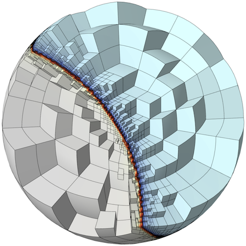

# Finite Elements and Convergence with MFEM

## At a Glance
<!-- (Expected # minutes to complete) %% temporarily omit -->

```
Questions                    |Objectives                      |Key Points
-----------------------------|--------------------------------|---------------------------
What is a finite element     |Understand basic finite element |Basis functions determine
method?                      |machinery                       |the quality of the solution
                             |                                |
What is a high order method? |Understand  how polynomial      |High order methods add more
                             |order affects simulations       |unknowns on the same mesh
                             |                                |for more precise solutions
                             |                                |
What is convergence?         |Understand how convergence and  |High order methods converge
                             |convergence rate is calculated  |faster for smooth solutions
```

**Note:** To begin this lesson...
```
cd handson/mfem/examples/atpesc/mfem
```

## A Widely Applicable Equation

In this lesson, we demonstrate the discretization of a simple Poisson problem using
the [MFEM library](http://mfem.org) and examine the finite element approximation error
under uniform refinement. An example of this equation is steady-state [heat](../hand_coded_heat/lesson.md)
[conduction](../time_integrators/lesson.md).

|[](ex8.png)| [](diffusion.png)|

### Governing Equation

The [_Poisson Equation_](https://en.wikipedia.org/wiki/Poisson's_equation) is a partial
differential equation (PDE) that can be used to model steady-state heat conduction,
electric potentials and gravitational fields. In mathematical terms ...

||(1)|

where _u_ is the potential field and _f_ is the source function. This PDE is a generalization
of the [_Laplace Equation_](https://en.wikipedia.org/wiki/Laplace%27s_equation).

### Finite element basics

To solve the above continuous equation using computers we need to
[discretize](https://en.wikipedia.org/wiki/Discretization) it by introducing a finite
(discrete) number of unknowns to compute for.
In the [_Finite Element Method_](https://en.wikipedia.org/wiki/Finite_element_method) (FEM), this is
done using the concept of _basis functions_.

Instead of calculating the exact analytic solution _u_, consider approximating it by

||(2)|

where  are scalar unknown coefficients and
 are known _basis functions_. They are
typically piecewise-polynomial functions which are only non-zero on small portions of the
computational mesh. With finite elements, the mesh can be totally unstructured, curved and
non-conforming.

|[](mesh.png)|

To solve for the unknown coefficients, we multiply Poisson's equation by another (test)
basis function  and integrate by parts
to obtain

||(3)|

for every basis function .
(Here we are assuming homogeneous Dirichlet boundary conditions, corresponding e.g. to
zero temperature on the whole boundary.)

Since the basis functions are known, we can rewrite (3) as

||(4)|

where

||(5)|
||(6)|
||(7)|

This is a  linear system that
can be solved [directly](../superlu-mfem/lesson.md) or [iterarively](../iterativesolvers/lesson.md)
for the unknown coefficients. Note that we are free to choose the basis functions
 as we see fit.

---

## Convergence Study Source Code

To define the system we need to solve, we need three things. First, we need to define our
basis functions which live on the computational mesh.

```c++
   // order is the FEM basis functions polynomial order
   FiniteElementCollection *fec = new H1_FECollection(order, dim);

   // pmesh is the parallel computational mesh
   ParFiniteElementSpace *fespace = new ParFiniteElementSpace(pmesh, fec);
```

This defines a collection of H1 functions (meaning they have well-defined gradient) of
a given polynomial order on a parallel computational mesh pmesh. Next, we need to define
the integrals in Equation (5)

```c++
   ParBilinearForm *a = new ParBilinearForm(fespace);
   ConstantCoefficient one(1.0);
   a->AddDomainIntegrator(new DiffusionIntegrator(one));
   a->Assemble();
```

and Equation (6)

```c++
   // f_exact is a C function defining the source
   FunctionCoefficient f(f_exact);
   ParLinearForm *b = new ParLinearForm(fespace);
   b->AddDomainIntegrator(new DomainLFIntegrator(f));
   b->Assemble();
```

This defines the matrix A and the vector b. We then solve the linear
system for our solution vector x using [AMG-preconditioned](../AMG/lesson.md) PCG iteration.

```c++
   // FEM -> Linear System
   HypreParMatrix A;
   Vector B, X;
   a->FormLinearSystem(ess_tdof_list, x, *b, A, X, B);

   // AMG preconditioner
   HypreBoomerAMG *amg = new HypreBoomerAMG(A);
   amg->SetPrintLevel(0);

   // PCG Krylov solver
   HyprePCG *pcg = new HyprePCG(A);
   pcg->SetTol(1e-12);
   pcg->SetMaxIter(200);
   pcg->SetPrintLevel(0);
   pcg->SetPreconditioner(*amg);

   // Solve the system A X = B
   pcg->Mult(B, X);

   // Linear System -> FEM
   a->RecoverFEMSolution(X, *b, x);
```

In this lesson we know what the exact solution is, so we can measure the amount of
error in our approximate solution in two ways:

||(8)|
||(9)|

The second one is know as the _energy norm_, which is derived directly from the weak form of the PDE.

We expect the error to behave like

||(10)|

where  is the mesh size, 
is a mesh-independent constant and  is the
[_convergence rate_](https://en.wikipedia.org/wiki/Rate_of_convergence).

Given approximations at two different mesh resolutions, we can  estimate the convergence rate as
follows ( doesn't change when we refine the mesh and compare runs):

||(11)|

In code this is implemented in a refinement loop as follows:

```c++
   double l2_err = x.ComputeL2Error(u);
   double h1_err = x.ComputeH1Error(&u, &u_grad, &one, 1.0, 1);
   pmesh->GetCharacteristics(h_min, h_max, kappa_min, kappa_max);

   l2_rate = log(l2_err/l2_err_prev) / log(h_min/h_prev);
   h1_rate = log(h1_err/h1_err_prev) / log(h_min/h_prev);
```

---

## Running the Convergence Study

The convergence study in `handson/mfem/examples/atpesc/mfem` has the following options

```
./convergence --help

Usage: ./convergence [options] ...
Options:
   -h, --help
	Print this help message and exit.
   -m <string>, --mesh <string>, current value: ../../../data/star.mesh
	Mesh file to use.
   -o <int>, --order <int>, current value: 1
	Finite element order (polynomial degree).
   -sc, --static-condensation, -no-sc, --no-static-condensation, current option: --no-static-condensation
	Enable static condensation.
   -r <int>, --refinements <int>, current value: 4
	Number of total uniform refinements
   -sr <int>, --serial-refinements <int>, current value: 2
	Maximum number of serial uniform refinements
   -f <double>, --frequency <double>, current value: 1
	Set the frequency for the exact solution.
```

### Run 1 (Low order)

In this run, we will examine the error after 7 uniform refinements in both the L2 and H1 norms using
first order (linear) basis functions. We use the `star.mesh` 2D mesh file.

```
./convergence -r 7
Options used:
   --mesh ../../../data/star.mesh
   --order 1
   --no-static-condensation
   --refinements 7
   --serial-refinements 2
   --frequency 1
----------------------------------------------------------------------------------------
DOFs            h               L^2 error       L^2 rate        H^1 error       H^1 rate
----------------------------------------------------------------------------------------
31              0.4876          0.3252          0               2.631           0
101             0.2438          0.09293         1.807           1.387           0.9229
361             0.1219          0.02393         1.957           0.7017          0.9836
1361            0.06095         0.006027        1.989           0.3518          0.996
5281            0.03048         0.00151         1.997           0.176           0.999
20801           0.01524         0.0003776       1.999           0.08803         0.9997
82561           0.007619        9.441e-05       2               0.04402         0.9999
```

Note that the L2 error is converging at a rate of 2 while the H1 error is only converging at a rate of 1.

### Run 2 (High order)

Now consider the same run only we are using 3rd order (cubic) basis functions instead.

```
./convergence -r 7 -o 3
Options used:
   --mesh ../../../data/star.mesh
   --order 3
   --no-static-condensation
   --refinements 7
   --serial-refinements 2
   --frequency 1
----------------------------------------------------------------------------------------
DOFs            h               L^2 error       L^2 rate        H^1 error       H^1 rate
----------------------------------------------------------------------------------------
211             0.4876          0.004777        0               0.118           0
781             0.2438          0.0003178       3.91            0.01576         2.905
3001            0.1219          2.008e-05       3.984           0.001995        2.982
11761           0.06095         1.258e-06       3.997           0.0002501       2.996
46561           0.03048         7.864e-08       4               3.129e-05       2.999
185281          0.01524         4.915e-09       4               3.912e-06       3
739201          0.007619        3.072e-10       4               4.891e-07       3
```

The L2 error is now converging at a rate of 4 and the H1 error is converging at a rate of 3.
This is because the exact solution in these runs is smooth, so higher-order methods
approximate it better.

#### Questions

> **How many unknowns do we need in runs 1 and 2 to get 4 digits of accuracy? Which method is more efficient: low-order or high-order?**

|<font color="white">The high-order methods is more efficient. It needs only 3001 unknowns compared to 82561 unknowns for the low-order method!</font>|

### Run 3 (3D example)
The previous two runs used a 2D mesh in serial, but the same code can be used to run a 3D problem in parallel.

```
${MPIEXEC_OMPI} -n 4 ./convergence -r 4 -o 2 -m ../../../data/inline-hex.mesh
Options used:
   --mesh ../../../data/inline-hex.mesh
   --order 2
   --no-static-condensation
   --refinements 4
   --serial-refinements 2
   --frequency 1
----------------------------------------------------------------------------------------
DOFs            h               L^2 error       L^2 rate        H^1 error       H^1 rate
----------------------------------------------------------------------------------------
729             0.25            0.001386        0               0.02215         0
4913            0.125           0.0001772       2.967           0.005532        2.002
35937           0.0625          2.227e-05       2.993           0.001377        2.007
274625          0.03125         2.787e-06       2.998           0.0003441       2
```

#### Questions

> **Experiment with different orders in 2D and 3D. What convergence rate will you expect in L2 and H1 for a given basis order ?**

|<font color="white"> For a smooth exact solution, the convergence rate in energy norm (H1) is p. Using the so-called Nitsche's Trick, one can prove that we pick an additional order in L2, so the convergence rate there is p+1</font>|

---

## Out-Brief

We demonstrated the ease of implementing a order and dimension independent finite element
code in MFEM. We discussed the basics of the finite element method as well as demonstrated
the effect of the polynomial order of the basis functions on convergence rates.

### Further Reading

To learn more about MFEM, including example codes and miniapps visit [mfem.org](http://mfem.org).

<!-- Insert space, horizontal line, and link to HandsOnLesson table -->

&nbsp;

---

[Back to all HandsOnLessons](../lessons.md)
