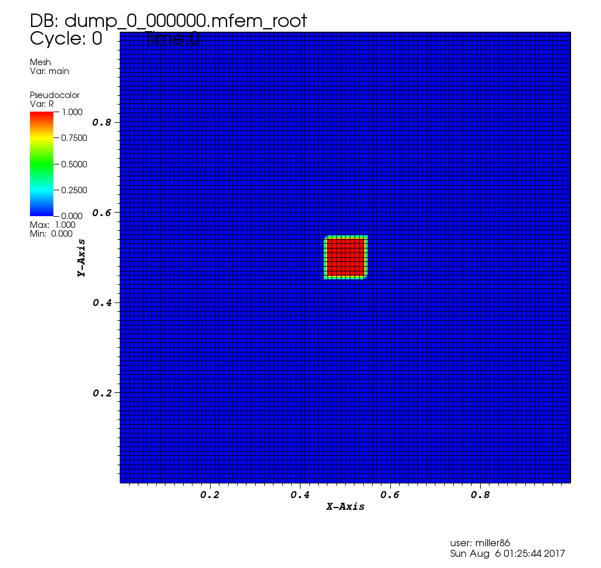
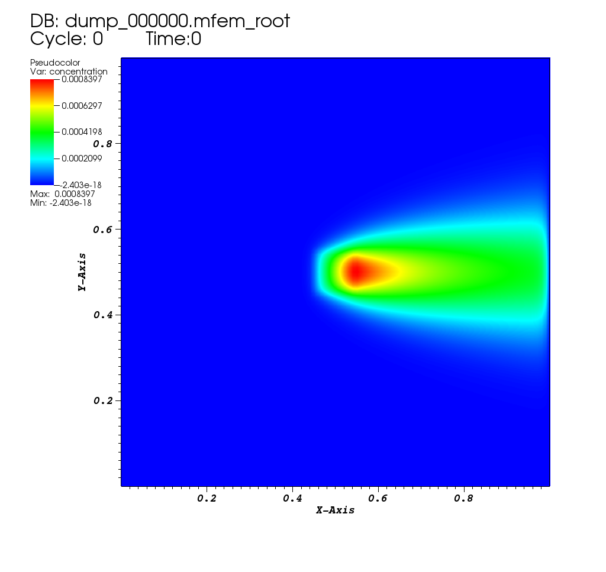
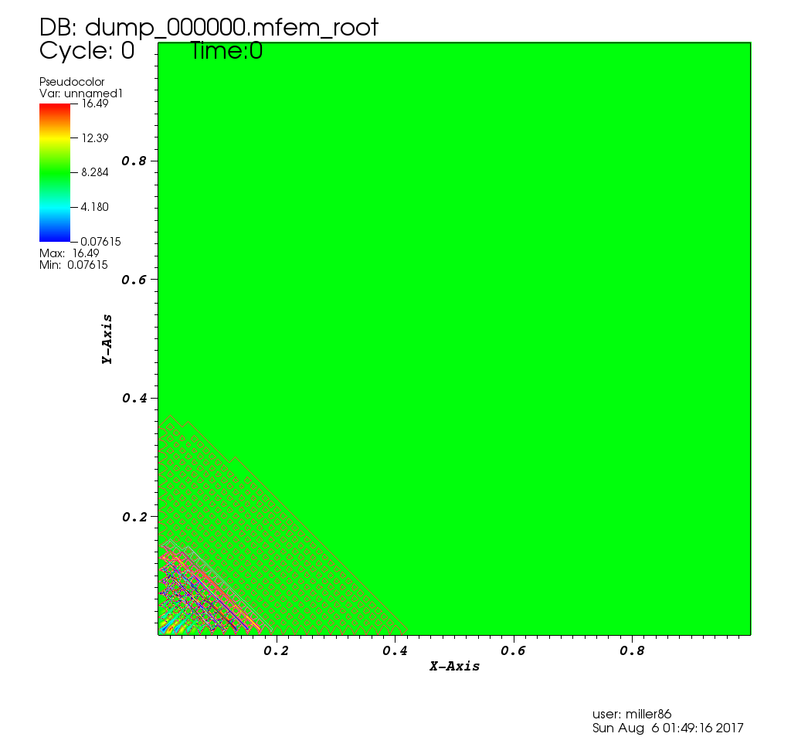
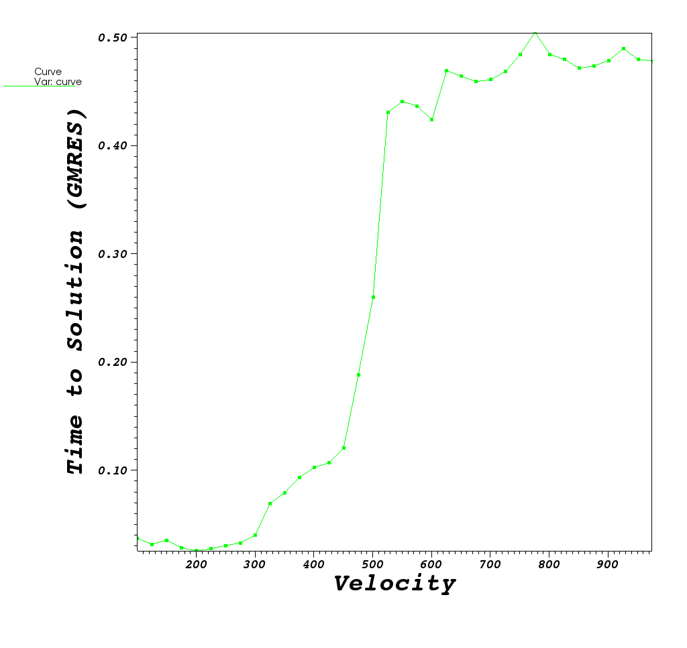
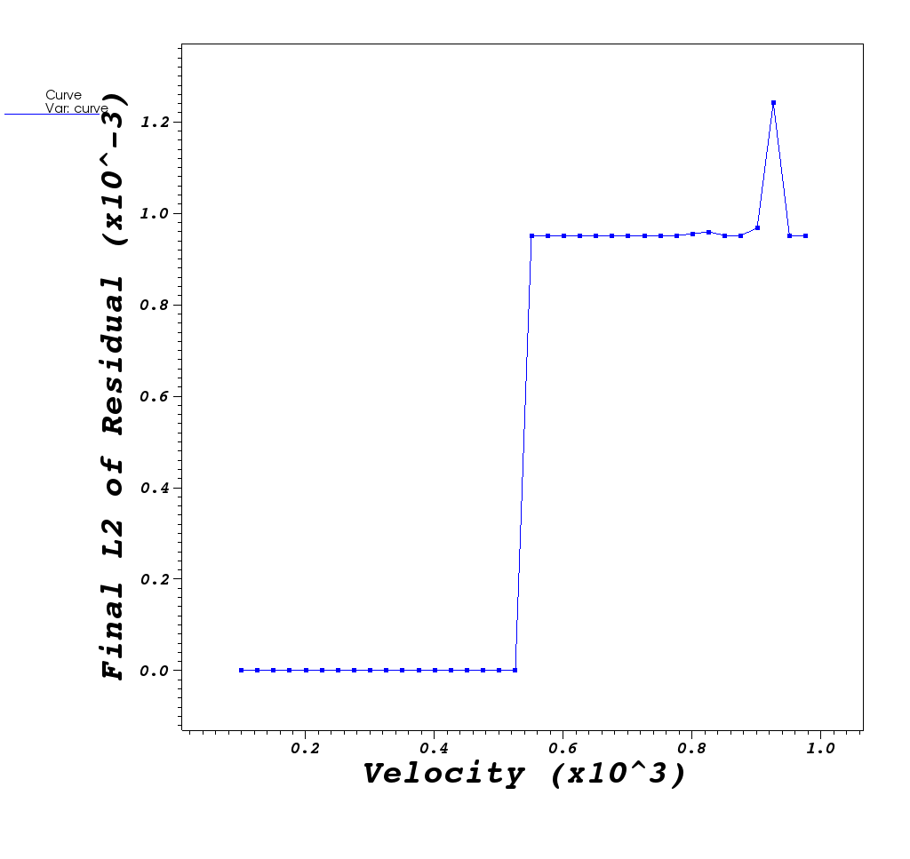
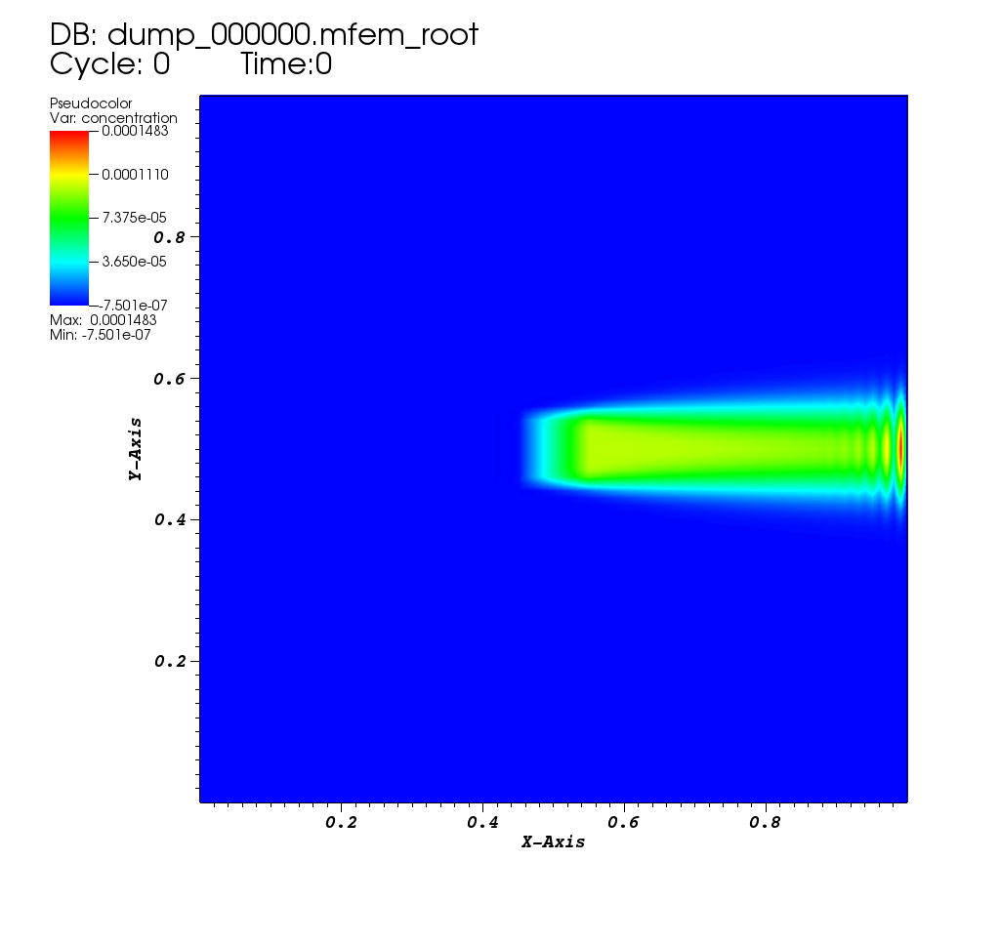

# Sparse Direct Solver

## At A Glance

```
Questions                  |Objectives                      |Key Points
---------------------------|--------------------------------|----------
Why need direct solver?    | Can obtain accurate solution   | Robust for difficult problems
What parameters affect     | Try different ordering options | Performance (time & memory) 
performance?               |                                | can vary a lot
```

## The problem being solved

The example is modeling the steady state convection-diffusion equation in 2D
with a constant velocity.  This equation is used to model the concentration
of something in a fluid as it diffuses and flows through the fluid.
The equation is as follows:

||(1)|

Where _u_ is the concentration that we are tracking,
 is the diffusion rate,
_v_ is the velocity of the flow and _R_ is a concentration source.
 
In the application we use here, the velocity vector is pointing at _+x_ and
the magnitude is set by the user (default of 100),
 is fixed at 1.0, and the
source is 0.0 everywhere except for a small disc centered at the middle of the
domain where it is 1.0.

|Initial Condition|
|:---:|
|[](mfem-superlu0000.png)|
 
This problem is well known to cause convergence problems for iterative solvers,
for larger v. We use MFEM as a vehicle to demonstrate the use of distributed,
parallel [SuperLU_DIST](http://crd-legacy.lbl.gov/~xiaoye/SuperLU/)
to show the use of a direct solver to solve very ill-conditioned linear systems. 

## The Example Source Code

## Running the Example

### Run 1: default setting with GMRES solver, velocity = 100

```
$ ./convdiff

Options used:
   --refine 0
   --order 1
   --velocity 100
   --no-visit
   --no-superlu
   --slu-colperm 0
Number of unknowns: 10201
=============================================
Setup phase times:
=============================================
GMRES Setup:
  wall clock time = 0.010000 seconds
  wall MFLOPS     = 0.000000
  cpu clock time  = 0.010000 seconds
  cpu MFLOPS      = 0.000000

L2 norm of b: 9.500000e-04
Initial L2 norm of residual: 9.500000e-04
=============================================

Iters     resid.norm     conv.rate  rel.res.norm
-----    ------------    ---------- ------------
    1    4.065439e-04    0.427941   4.279409e-01
    2    1.318995e-04    0.324441   1.388415e-01
    3    4.823031e-05    0.365660   5.076874e-02
    ...
   23    2.436775e-16    0.249025   2.565027e-13

Final L2 norm of residual: 2.436857e-16

=============================================
Solve phase times:
=============================================
GMRES Solve:
  wall clock time = 0.030000 seconds
  wall MFLOPS     = 0.000000
  cpu clock time  = 0.020000 seconds
  cpu MFLOPS      = 0.000000

GMRES Iterations = 23
Final GMRES Relative Residual Norm = 2.56511e-13
Time required for solver:  0.0362886 (s)
```

|Steady State|
|:---:|
|[](mfem-superlu0005.png)|

---

### Run 2: increase velocity to 1000, GMRES does not converge anymore

```
$ ./convdiff --velocity 1000

Options used:
   --refine 0
   --order 1
   --velocity 1000
   --no-visit
   --no-superlu
   --slu-colperm 0
Number of unknowns: 10201
=============================================
Setup phase times:
=============================================
GMRES Setup:
  wall clock time = 0.020000 seconds
  wall MFLOPS     = 0.000000
  cpu clock time  = 0.010000 seconds
  cpu MFLOPS      = 0.000000

L2 norm of b: 9.500000e-04
Initial L2 norm of residual: 9.500000e-04
=============================================

Iters     resid.norm     conv.rate  rel.res.norm
-----    ------------    ---------- ------------
    1    9.500000e-04    1.000000   1.000000e+00
    2    9.500000e-04    1.000000   1.000000e+00
    3    9.500000e-04    1.000000   1.000000e+00
    ...
  200    9.500000e-04    1.000000   1.000000e+00
```

Below, we plot behavior of the GMRES method for velocity values in the
range [100,1000] at incriments, _dv_, of 25 and also show an animation
of the solution GMRES gives as velocity increases

|Solutions @_dv_=25 in [100,1000]|Contours of Solution @ _vel=1000_|
|:---:||:---:|
|<video src="gmres.mpg" width="400" height="300" controls preload></video>|[](mfem-superlu0003.png)|

|Time to Solution|L2 norm of final residual|
|:---:||:---:|
|[](gmres_time.png)|[](gmres_residual.png)|

> **What do you think is happening?**

|<font color="white">GMRES method works ok for low velocity values. As velocity increases, GMRES method eventually crosses a threshold where it can no longer provide a useful result.</font>|

### Run 3: Now use SuperLU_DIST, with default options
```
$ ./convdiff -slu --velocity 1000

Options used:
   --refine 0
   --order 1
   --velocity 1000
   --no-visit
   --superlu
   --slu-colperm 0
Number of unknowns: 10201

** Memory Usage **********************************
** NUMfact space (MB): (sum-of-all-processes)
    L\U :           41.12 |  Total :    50.72
** Total highmark (MB):
    Sum-of-all :    62.27 | Avg :    62.27  | Max :    62.27
**************************************************
Time required for solver:  38.2684 (s)
Final L2 norm of residual: 1.55553e-18
```

|Stead State For _vel=1000_|
|:---:|
|[](mfem-superlu0004.png)|

### Run 4: Now use SuperLU_DIST, with MMD(A'+A) ordering.
```
$ ./convdiff -slu --velocity 1000 --slu-colperm 2

Options used:
   --refine 0
   --order 1
   --velocity 1000
   --no-visit
   --superlu
   --slu-colperm 2
Number of unknowns: 10201
       Nonzeros in L       594238
       Nonzeros in U       580425
       nonzeros in L+U     1164462
       nonzeros in LSUB    203857

** Memory Usage **********************************
** NUMfact space (MB): (sum-of-all-processes)
    L\U :           10.07 |  Total :    16.19
** Total highmark (MB):
    Sum-of-all :    16.19 | Avg :    16.19  | Max :    16.19
**************************************************
Time required for solver:  0.780516 (s)
Final L2 norm of residual: 1.52262e-18
```
NOTE: the number of nonzeros in L+U is much smaller than natural ordering.
This affects the memory usage and runtime.

### Run 5: Now use SuperLU_DIST, with Metis(A'+A) ordering.
```
$ ./convdiff -slu --velocity 1000 --slu-colperm 4

Options used:
   --refine 0
   --order 1
   --velocity 1000
   --no-visit
   --superlu
   --slu-colperm 4
Number of unknowns: 10201
       Nonzeros in L       522306
       Nonzeros in U       527748
       nonzeros in L+U     1039853
       nonzeros in LSUB    218211

** Memory Usage **********************************
** NUMfact space (MB): (sum-of-all-processes)
    L\U :            9.24 |  Total :    15.64
** Total highmark (MB):
    Sum-of-all :    15.64 | Avg :    15.64  | Max :    15.64
**************************************************
Time required for solver:  0.786936 (s)
Final L2 norm of residual: 1.55331e-18
```

### Run 6: Now use SuperLU_DIST, with Metis(A'+A) ordering, using 4 MPI tasks,
    on a larger problem.
```
$ mpirun -np 4 ./convdiff --refine 2 --velocity 1000 -slu --slu-colperm 4


```

## Out-Brief

Here, re-emphasize the lesson objectives and key points.

Its fine to go into greater detail about questions or objectives this lesson
did not fully cover.

### Further Reading

To learn more about sparse direct solver, see Gene Golub SIAM Summer School
course materials:
[Lecture Notes](http://www.siam.org/students/g2s3/2013/lecturers/XSLi/Lecture-Notes/sherry.pdf),
[Book Chapter](http://crd-legacy.lbl.gov/~xiaoye/g2s3-summary.pdf), and
[Video](http://www.siam.org/students/g2s3/2013/course.html)

<!-- Insert space, horizontal line, and link to HandsOnLesson table -->

&nbsp;

---

[Back to all HandsOnLessons](../lessons.md)
