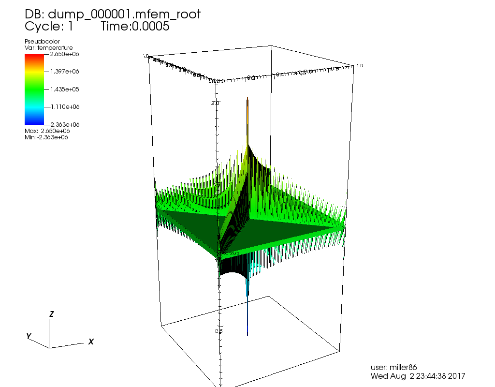
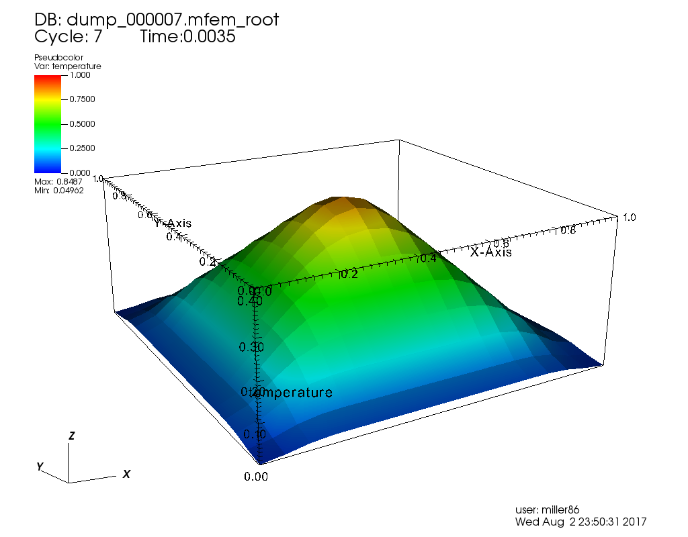
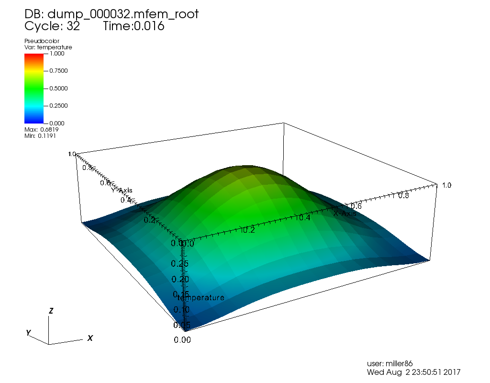
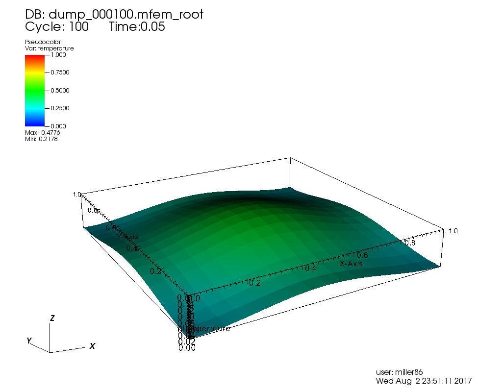
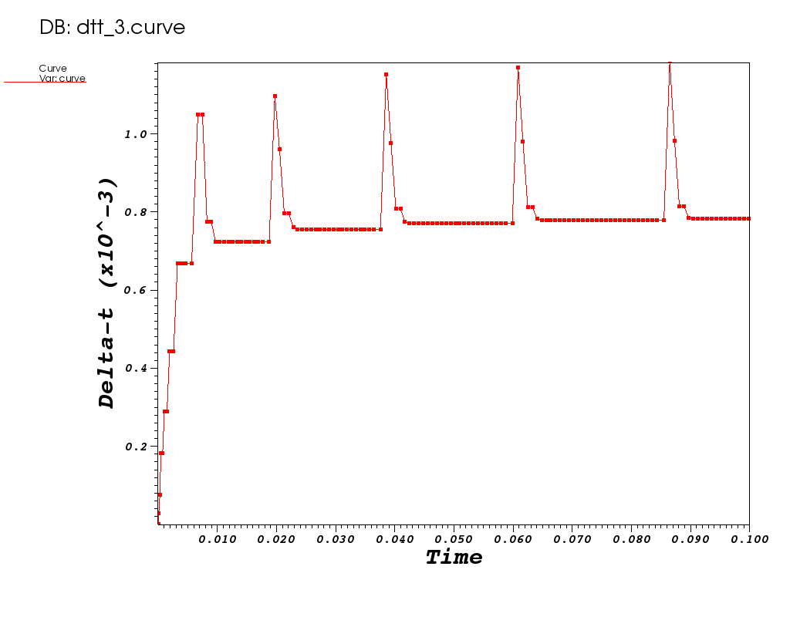
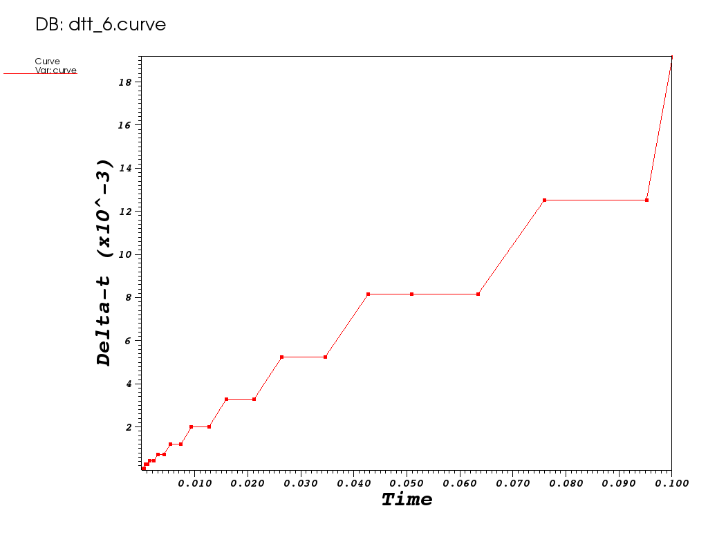
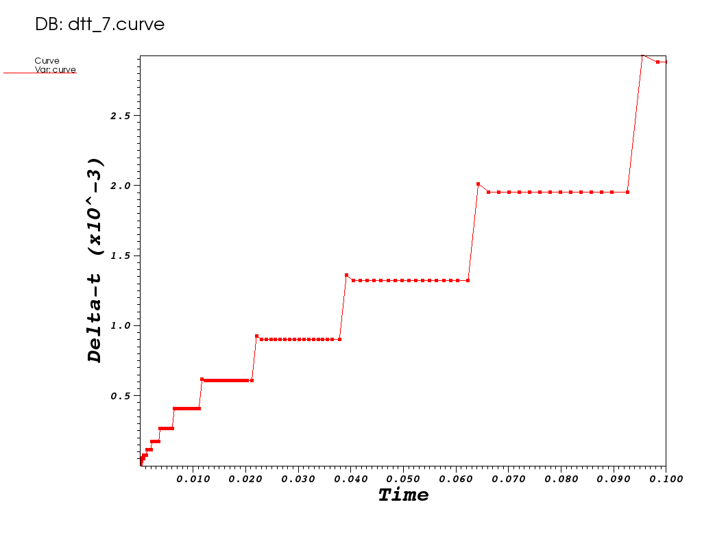
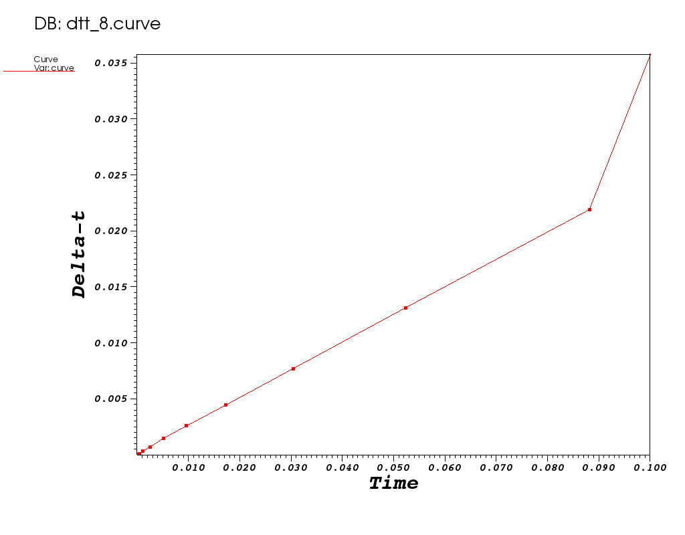

# Time Integrators

## At A Glance (15 minutes)

```
Questions                     |Objectives                      |Key Points
------------------------------|--------------------------------|----------
What is the SUNDIALS Package? |Compare fixed and adaptive time |Time integration considerations
                              |integrator techniques           |play a role in time to solution
                              |                                |
What is a time integrator?    |Observe impact of order of      |The SUNDIALS package has robust,
                              |on time to solution/flop count  |flexible methods for time integration.
                              |                                |
What is adaptive time-step?   |                                |
```

## The problem being solved

The example application here, [transient-heat.cpp](transient-heat.cpp.numbered.txt),
uses MFEM and the ARKode package from SUNDIALS as a vehicle to demonstrate the use of the
[SUNDIALS](https://computation.llnl.gov/projects/sundials) suite
in both serial and parallel for more robust and flexible control over _time integration_
(e.g. discretization in time) of PDEs.

The application has been designed to solve a far more general form of the
[_Heat Equation_](https://en.wikipedia.org/wiki/Heat_equation)

||(1)|

<!---
|(2)|
--->

where the material thermal diffusivity is given by

which includes the same constant term 
as in [Lesson 1](../hand_coded_heat/lesson.md) plus a term
 which varies with
temperature, _u_, introducing the option of solving systems involving non-linearity.

The initial condition is a _pyramid_ or _ramp_ with value of _1_ at the
apex in the _middle_ of the computational domain and zero on the boundaries as
pictured in Figure 1.

|Figure 1|Figure 2|
|:---:|:---:|
|[](mfem_sundials_explicit0000.png)|[](pyramid_animated.gif)|

The main loop of this application is shown here...

```c++
304    // Perform time-integration
309    ode_solver->Init(oper);
310    double t = 0.0;
311    bool last_step = false;
312    for (int ti = 1; !last_step; ti++)
313    {
319       ode_solver->Step(u, t, dt);
320 
327       u_gf.SetFromTrueDofs(u);
328 
336       oper.SetParameters(u);
337       last_step = (t >= t_final - 1e-8*dt);
338    }
```

Later in this lesson, we'll show the lines of code that permit the 
application great flexibility in how it employs
[SUNDIALS](https://computation.llnl.gov/projects/sundials) to handle
time integration.

### Getting Help 
```
$ ./transient-heat --help
Usage: ./transient-heat [options] ...
Options:
   -h, --help
        Print this help message and exit.
   -d <int>, --dim <int>, current value: 2
        Number of dimensions in the problem (1 or 2).
   -r <int>, --refine <int>, current value: 0
        Number of times to refine the mesh uniformly.
   -o <int>, --order <int>, current value: 1
        Order (degree) of the finite elements.
   -ao <int>, --arkode-order <int>, current value: 4
        Order of the time integration scheme.
   -tf <double>, --t-final <double>, current value: 0.1
        Final time; start time is 0.
   -dt <double>, --time-step <double>, current value: 0.001
        When using a fixed step, time step size.
   -a <double>, --alpha <double>, current value: 0.2
        Alpha coefficient for conductivity: kappa + alpha*temperature
   -k <double>, --kappa <double>, current value: 0.5
        Kappa coefficient conductivity: kappa + alpha*temperature
   -art <double>, --arkode-reltol <double>, current value: 0.0001
        Relative tolerance for ARKODE time integration.
   -aat <double>, --arkode-abstol <double>, current value: 0.0001
        Absolute tolerance for ARKODE time integration.
   -adt, --adapt-time-step, -fdt, --fixed-time-step, current option: --fixed-time-step
        Flag whether or not to adapt the time step.
   -imp, --implicit, -exp, --explicit, current option: --explicit
        Implicit or Explicit ODE solution.
   -v, --visit, -nov, --no_visit, current option: --no_visit
        Enable dumping of visit files.
```

**Note:** This application may be used to solve the same equation used in
[Lesson 1](../hand_coded_heat/lesson.md) by using command line options
`-d 1 -alpha 0`. The role of [Lesson 1's](../hand_coded_heat/lesson.md)
 is played by 
 here.
For all of the runs here, the application's default behavior is to set
 to 0.2 and
 to 0.5.

### Run 1: Explicit, Fixed  of 0.001

```
$ ./transient-heat -dt 0.001 --arkode-order 4 --explicit
Options used:
   --dim 2
   --refine 0
   --order 1
   --arkode-order 4
   --t-final 0.1
   --time-step 0.001
   --alpha 0.2
   --kappa 0.5
   --arkode-reltol 0.0001
   --arkode-abstol 0.0001
   --fixed-time-step
   --explicit
   --visit
Number of temperature unknowns: 289
Integrating the ODE ...
step 1, t = 0.001
ARKODE:
  num steps: 1, num evals: 7, num lin setups: 0, num nonlin sol iters: 0
  method order: 4, last dt: 0.001, next dt: 0.001
step 2, t = 0.002
ARKODE:
  num steps: 2, num evals: 13, num lin setups: 0, num nonlin sol iters: 0
  method order: 4, last dt: 0.001, next dt: 0.001
step 3, t = 0.003
ARKODE:
  num steps: 3, num evals: 19, num lin setups: 0, num nonlin sol iters: 0
  method order: 4, last dt: 0.001, next dt: 0.001
.
.
.
ARKODE:
  num steps: 97, num evals: 583, num lin setups: 0, num nonlin sol iters: 0
  method order: 4, last dt: 0.001, next dt: 0.001
step 98, t = 0.098
ARKODE:
  num steps: 98, num evals: 589, num lin setups: 0, num nonlin sol iters: 0
  method order: 4, last dt: 0.001, next dt: 0.001
step 99, t = 0.099
ARKODE:
  num steps: 99, num evals: 595, num lin setups: 0, num nonlin sol iters: 0
  method order: 4, last dt: 0.001, next dt: 0.001
step 100, t = 0.1
ARKODE:
  num steps: 100, num evals: 601, num lin setups: 0, num nonlin sol iters: 0
  method order: 4, last dt: 0.001, next dt: 0.001
Integer ops        = 1010644516
Floating point ops = 57427320
Memory used        = 57717204 bytes
```

The first few iterations of this explicit algorithm are plotted below.

|Iteration 0|Iteration 1|Iteration 2|
|:---:|:---:|:---:|
|[](mfem_sundials_explicit0000.png)|[](mfem_sundials_explicit0001.png)|[](mfem_sundials_explicit0002.png)

> **What do you think happened?** (triple-click box below to reveal answer)

|<font color="white">The explicit algorithm is unstable for the specified timestep.</font>|

> **How can we make this explicit method work?** (triple-click box below to reveal answer)

|<font color="white">The shrink the timestep.</font>|

---

### Run 2: Explicit, Smaller  of 0.0005

```
[mcmiller@cooleylogin1 ~/tmp]$ make transient_heat_2
make EXEC=transient-heat PROB=transient_heat_2 EXEC_ARGS="-dt 0.0005 --arkode-order 4 --explicit" EXEC_OUTON=-v run
make[1]: Entering directory `/gpfs/mira-home/mcmiller/tmp'
./transient-heat -dt 0.0005 --arkode-order 4 --explicit
~/tmp/transient_heat_2 ~/tmp
--------------------------------------------------------------------------
No OpenFabrics connection schemes reported that they were able to be
used on a specific port.  As such, the openib BTL (OpenFabrics
support) will be disabled for this port.

  Local host:           cooleylogin1
  Local device:         mlx4_0
  Local port:           1
  CPCs attempted:       rdmacm, udcm
--------------------------------------------------------------------------
Options used:
   --dim 2
   --refine 0
   --order 1
   --arkode-order 4
   --t-final 0.1
   --time-step 0.0005
   --alpha 0.2
   --kappa 0.5
   --arkode-reltol 0.0001
   --arkode-abstol 0.0001
   --fixed-time-step
   --explicit
   --visit
Number of temperature unknowns: 289
Integrating the ODE ...
step 1, t = 0.0005
ARKODE:
  num steps: 1, num evals: 7, num lin setups: 0, num nonlin sol iters: 0
  method order: 4, last dt: 0.0005, next dt: 0.0005
step 2, t = 0.001
ARKODE:
  num steps: 2, num evals: 13, num lin setups: 0, num nonlin sol iters: 0
  method order: 4, last dt: 0.0005, next dt: 0.0005
step 3, t = 0.0015
ARKODE:
  num steps: 3, num evals: 19, num lin setups: 0, num nonlin sol iters: 0
  method order: 4, last dt: 0.0005, next dt: 0.0005
.
.
.
step 198, t = 0.099
ARKODE:
  num steps: 198, num evals: 1189, num lin setups: 0, num nonlin sol iters: 0
  method order: 4, last dt: 0.0005, next dt: 0.0005
step 199, t = 0.0995
ARKODE:
  num steps: 199, num evals: 1195, num lin setups: 0, num nonlin sol iters: 0
  method order: 4, last dt: 0.0005, next dt: 0.0005
step 200, t = 0.1
ARKODE:
  num steps: 200, num evals: 1201, num lin setups: 0, num nonlin sol iters: 0
  method order: 4, last dt: 0.0005, next dt: 0.0005
Integer ops        = 2330325813
Floating point ops = 181844398
Memory used        = 82719437 bytes
```

|Iteration 7|Iteration 32|Iteration 100|
|:---:|:---:|:---:|
|[](mfem_sundials_explicit20000.png)|[](mfem_sundials_explicit20001.png)|[](mfem_sundials_explicit20002.png)

---

### Run 3: Explicit, Adaptive  Absolute and Relative Tolerance 1e-6

```
[mcmiller@cooleylogin1 ~/tmp]$ make transient_heat_3
make EXEC=transient-heat PROB=transient_heat_3 EXEC_ARGS="-adt --arkode-order 4 --arkode-abstol 1e-6 --arkode-reltol 1e-6 --explicit" EXEC_OUTON=-v run
make[1]: Entering directory `/gpfs/mira-home/mcmiller/tmp'
./transient-heat -adt --arkode-order 4 --arkode-abstol 1e-6 --arkode-reltol 1e-6 --explicit
~/tmp/transient_heat_3 ~/tmp
--------------------------------------------------------------------------
No OpenFabrics connection schemes reported that they were able to be
used on a specific port.  As such, the openib BTL (OpenFabrics
support) will be disabled for this port.

  Local host:           cooleylogin1
  Local device:         mlx4_0
  Local port:           1
  CPCs attempted:       rdmacm, udcm
--------------------------------------------------------------------------
Options used:
   --dim 2
   --refine 0
   --order 1
   --arkode-order 4
   --t-final 0.1
   --time-step 0.001
   --alpha 0.2
   --kappa 0.5
   --arkode-reltol 1e-06
   --arkode-abstol 1e-06
   --adapt-time-step
   --explicit
   --visit
Number of temperature unknowns: 289
Integrating the ODE ...
step 1, t = 1.3850325e-09
ARKODE:
  num steps: 1, num evals: 10, num lin setups: 0, num nonlin sol iters: 0
  method order: 4, last dt: 1.3850325e-09, next dt: 1.1404192e-07
step 2, t = 1.1542696e-07
ARKODE:
  num steps: 2, num evals: 16, num lin setups: 0, num nonlin sol iters: 0
  method order: 4, last dt: 1.1404192e-07, next dt: 1.8735665e-06
step 3, t = 1.9889934e-06
ARKODE:
  num steps: 3, num evals: 22, num lin setups: 0, num nonlin sol iters: 0
  method order: 4, last dt: 1.8735665e-06, next dt: 2.9257093e-05
.
.
.
step 134, t = 0.098921587
ARKODE:
  num steps: 134, num evals: 853, num lin setups: 0, num nonlin sol iters: 0
  method order: 4, last dt: 0.00078192401, next dt: 0.00078192401
step 135, t = 0.099703512
ARKODE:
  num steps: 135, num evals: 859, num lin setups: 0, num nonlin sol iters: 0
  method order: 4, last dt: 0.00078192401, next dt: 0.00078192401
step 136, t = 0.1
ARKODE:
  num steps: 136, num evals: 865, num lin setups: 0, num nonlin sol iters: 0
  method order: 4, last dt: 0.0002964885, next dt: 0.0002964885
Integer ops        = 2085145055
Floating point ops = 199642899
Memory used        = 67423151 bytes
```

| Plot of  vs _t_|
|:---:|
|[](mfem_sundials_dtt0000.png)|

---

### Run 4: Implicit, Fixed  at 0.001

```
[mcmiller@cooleylogin1 ~/tmp]$ make transient_heat_4
make EXEC=transient-heat PROB=transient_heat_4 EXEC_ARGS="-dt 0.001 --arkode-order 4 --implicit" EXEC_OUTON=-v run
make[1]: Entering directory `/gpfs/mira-home/mcmiller/tmp'
./transient-heat -dt 0.001 --arkode-order 4 --implicit
~/tmp/transient_heat_4 ~/tmp
--------------------------------------------------------------------------
No OpenFabrics connection schemes reported that they were able to be
used on a specific port.  As such, the openib BTL (OpenFabrics
support) will be disabled for this port.

  Local host:           cooleylogin1
  Local device:         mlx4_0
  Local port:           1
  CPCs attempted:       rdmacm, udcm
--------------------------------------------------------------------------
Options used:
   --dim 2
   --refine 0
   --order 1
   --arkode-order 4
   --t-final 0.1
   --time-step 0.001
   --alpha 0.2
   --kappa 0.5
   --arkode-reltol 0.0001
   --arkode-abstol 0.0001
   --fixed-time-step
   --implicit
   --visit
Number of temperature unknowns: 289
Integrating the ODE ...
step 1, t = 0.001
ARKODE:
  num steps: 1, num evals: 0, num lin setups: 1, num nonlin sol iters: 10
  method order: 4, last dt: 0.001, next dt: 0.001
step 2, t = 0.002
ARKODE:
  num steps: 2, num evals: 0, num lin setups: 1, num nonlin sol iters: 16
  method order: 4, last dt: 0.001, next dt: 0.001
step 3, t = 0.003
ARKODE:
  num steps: 3, num evals: 0, num lin setups: 1, num nonlin sol iters: 21
  method order: 4, last dt: 0.001, next dt: 0.001
.
.
.
ARKODE:
  num steps: 97, num evals: 0, num lin setups: 5, num nonlin sol iters: 509
  method order: 4, last dt: 0.001, next dt: 0.001
step 98, t = 0.098
ARKODE:
  num steps: 98, num evals: 0, num lin setups: 5, num nonlin sol iters: 514
  method order: 4, last dt: 0.001, next dt: 0.001
step 99, t = 0.099
ARKODE:
  num steps: 99, num evals: 0, num lin setups: 5, num nonlin sol iters: 519
  method order: 4, last dt: 0.001, next dt: 0.001
step 100, t = 0.1
ARKODE:
  num steps: 100, num evals: 0, num lin setups: 5, num nonlin sol iters: 524
  method order: 4, last dt: 0.001, next dt: 0.001
Integer ops        = 2331254488
Floating point ops = 248347397
Memory used        = 62734180 bytes
```

Take note of the number of non-linear solution iterations here, 524.

> **How is all the flexiblity demonstrated here possible?**

|<font color="white">The lines of code below illustrate how the application is taking advantage of the SUNDIALS numerical package to affect various methods of solution.</font>|

```c++
204    // Define the ARKODE solver used for time integration. Either implicit or explicit.
205    ODESolver *ode_solver = NULL;
206    ARKODESolver *arkode = NULL;
207    SundialsJacSolver sun_solver; // Used by the implicit ARKODE solver.
208    if (implicit)
209    {
210       arkode = new ARKODESolver(MPI_COMM_WORLD, ARKODESolver::IMPLICIT);
211       arkode->SetLinearSolver(sun_solver);
212    }
213    else
214    {
215       arkode = new ARKODESolver(MPI_COMM_WORLD, ARKODESolver::EXPLICIT);
216       //arkode->SetERKTableNum(FEHLBERG_13_7_8);
217    }
218    arkode->SetStepMode(ARK_ONE_STEP);
219    arkode->SetSStolerances(arkode_reltol, arkode_abstol);
220    arkode->SetOrder(arkode_order);
221    arkode->SetMaxStep(t_final / 2.0);
222    if (!adaptdt)
223    {
224       arkode->SetFixedStep(dt);
225    }
226    ode_solver = arkode;
```

---

### Run 5: Implicit, Fixed  at 0.001, 2nd Order


```
[mcmiller@cooleylogin1 ~/tmp]$ make transient_heat_5
make EXEC=transient-heat PROB=transient_heat_5 EXEC_ARGS="-dt 0.001 --arkode-order 2 --implicit" EXEC_OUTON=-v run
make[1]: Entering directory `/gpfs/mira-home/mcmiller/tmp'
./transient-heat -dt 0.001 --arkode-order 2 --implicit
~/tmp/transient_heat_5 ~/tmp
--------------------------------------------------------------------------
No OpenFabrics connection schemes reported that they were able to be
used on a specific port.  As such, the openib BTL (OpenFabrics
support) will be disabled for this port.

  Local host:           cooleylogin1
  Local device:         mlx4_0
  Local port:           1
  CPCs attempted:       rdmacm, udcm
--------------------------------------------------------------------------
Options used:
   --dim 2
   --refine 0
   --order 1
   --arkode-order 2
   --t-final 0.1
   --time-step 0.001
   --alpha 0.2
   --kappa 0.5
   --arkode-reltol 0.0001
   --arkode-abstol 0.0001
   --fixed-time-step
   --implicit
   --visit
Number of temperature unknowns: 289
Integrating the ODE ...
step 1, t = 0.001
ARKODE:
  num steps: 1, num evals: 0, num lin setups: 1, num nonlin sol iters: 4
  method order: 2, last dt: 0.001, next dt: 0.001
step 2, t = 0.002
ARKODE:
  num steps: 2, num evals: 0, num lin setups: 1, num nonlin sol iters: 8
  method order: 2, last dt: 0.001, next dt: 0.001
step 3, t = 0.003
ARKODE:
  num steps: 3, num evals: 0, num lin setups: 1, num nonlin sol iters: 11
  method order: 2, last dt: 0.001, next dt: 0.001
step 4, t = 0.004
.
.
.
step 98, t = 0.098
ARKODE:
  num steps: 98, num evals: 0, num lin setups: 5, num nonlin sol iters: 220
  method order: 2, last dt: 0.001, next dt: 0.001
step 99, t = 0.099
ARKODE:
  num steps: 99, num evals: 0, num lin setups: 5, num nonlin sol iters: 222
  method order: 2, last dt: 0.001, next dt: 0.001
step 100, t = 0.1
ARKODE:
  num steps: 100, num evals: 0, num lin setups: 5, num nonlin sol iters: 224
  method order: 2, last dt: 0.001, next dt: 0.001
Integer ops        = 1482885073
Floating point ops = 119982846
Memory used        = 62118716 bytes
```

> **There are about half as many non-linear solver iterations, 224. Why?**

|<font color="white">Answer to Question</font>|

---

### Run 6: Implicit, Adaptive , Tolerances 1e-6 

```
[mcmiller@cooleylogin1 ~/tmp]$ make transient_heat_6
make EXEC=transient-heat PROB=transient_heat_6 EXEC_ARGS="-adt --arkode-order 4 --arkode-abstol 1e-6 --arkode-reltol 1e-6 --implicit" EXEC_OUTON=-v run
make[1]: Entering directory `/gpfs/mira-home/mcmiller/tmp'
./transient-heat -adt --arkode-order 4 --arkode-abstol 1e-6 --arkode-reltol 1e-6 --implicit
~/tmp/transient_heat_6 ~/tmp
--------------------------------------------------------------------------
No OpenFabrics connection schemes reported that they were able to be
used on a specific port.  As such, the openib BTL (OpenFabrics
support) will be disabled for this port.

  Local host:           cooleylogin1
  Local device:         mlx4_0
  Local port:           1
  CPCs attempted:       rdmacm, udcm
--------------------------------------------------------------------------
Options used:
   --dim 2
   --refine 0
   --order 1
   --arkode-order 4
   --t-final 0.1
   --time-step 0.001
   --alpha 0.2
   --kappa 0.5
   --arkode-reltol 1e-06
   --arkode-abstol 1e-06
   --adapt-time-step
   --implicit
   --visit
Number of temperature unknowns: 289
Integrating the ODE ...
step 1, t = 1.3850325e-09
ARKODE:
  num steps: 1, num evals: 0, num lin setups: 1, num nonlin sol iters: 5
  method order: 4, last dt: 1.3850325e-09, next dt: 1.1404192e-07
step 2, t = 1.1542696e-07
ARKODE:
  num steps: 2, num evals: 0, num lin setups: 2, num nonlin sol iters: 10
  method order: 4, last dt: 1.1404192e-07, next dt: 1.8735665e-06
step 3, t = 1.9889934e-06
ARKODE:
  num steps: 3, num evals: 0, num lin setups: 3, num nonlin sol iters: 17
  method order: 4, last dt: 1.8735665e-06, next dt: 3.7471329e-05
.
.
.
ARKODE:
  num steps: 24, num evals: 0, num lin setups: 14, num nonlin sol iters: 189
  method order: 4, last dt: 0.012499762, next dt: 0.019204807
step 25, t = 0.09505614
ARKODE:
  num steps: 25, num evals: 0, num lin setups: 15, num nonlin sol iters: 199
  method order: 4, last dt: 0.019204807, next dt: 0.019204807
step 26, t = 0.1
ARKODE:
  num steps: 26, num evals: 0, num lin setups: 16, num nonlin sol iters: 209
  method order: 4, last dt: 0.0049438602, next dt: 0.0049438602
Integer ops        = 1009761594
Floating point ops = 115569416
Memory used        = 41202775 bytes
```

| Plot of  vs _t_|
|:---:|
|[](mfem_sundials_dtt0001.png)|

---

### Run 7: Implicit, Adaptive , Tolerances 1e-6, 2nd Order

```
[mcmiller@cooleylogin1 ~/tmp]$ make transient_heat_7
make EXEC=transient-heat PROB=transient_heat_7 EXEC_ARGS="-adt --arkode-order 2 --arkode-abstol 1e-6 --arkode-reltol 1e-6 --implicit" EXEC_OUTON=-v run
make[1]: Entering directory `/gpfs/mira-home/mcmiller/tmp'
./transient-heat -adt --arkode-order 2 --arkode-abstol 1e-6 --arkode-reltol 1e-6 --implicit
~/tmp/transient_heat_7 ~/tmp
--------------------------------------------------------------------------
No OpenFabrics connection schemes reported that they were able to be
used on a specific port.  As such, the openib BTL (OpenFabrics
support) will be disabled for this port.

  Local host:           cooleylogin1
  Local device:         mlx4_0
  Local port:           1
  CPCs attempted:       rdmacm, udcm
--------------------------------------------------------------------------
Options used:
   --dim 2
   --refine 0
   --order 1
   --arkode-order 2
   --t-final 0.1
   --time-step 0.001
   --alpha 0.2
   --kappa 0.5
   --arkode-reltol 1e-06
   --arkode-abstol 1e-06
   --adapt-time-step
   --implicit
   --visit
Number of temperature unknowns: 289
Integrating the ODE ...
step 1, t = 1.3850325e-09
ARKODE:
  num steps: 1, num evals: 0, num lin setups: 1, num nonlin sol iters: 2
  method order: 2, last dt: 1.3850325e-09, next dt: 1.3850325e-05
step 2, t = 1.385171e-05
ARKODE:
  num steps: 2, num evals: 0, num lin setups: 2, num nonlin sol iters: 5
  method order: 2, last dt: 1.3850325e-05, next dt: 1.3850325e-06
step 3, t = 1.5236743e-05
ARKODE:
  num steps: 3, num evals: 0, num lin setups: 3, num nonlin sol iters: 8
  method order: 2, last dt: 1.3850325e-06, next dt: 2.770065e-05
.
.
.
ARKODE:
  num steps: 125, num evals: 0, num lin setups: 18, num nonlin sol iters: 313
  method order: 2, last dt: 0.0029289748, next dt: 0.0028752935
step 126, t = 0.095340247
ARKODE:
  num steps: 126, num evals: 0, num lin setups: 18, num nonlin sol iters: 316
  method order: 2, last dt: 0.0028752935, next dt: 0.0028752935
step 127, t = 0.09821554
ARKODE:
  num steps: 127, num evals: 0, num lin setups: 18, num nonlin sol iters: 319
  method order: 2, last dt: 0.0028752935, next dt: 0.0028752935
step 128, t = 0.1
ARKODE:
  num steps: 128, num evals: 0, num lin setups: 19, num nonlin sol iters: 323
  method order: 2, last dt: 0.0017844596, next dt: 0.0017844596
Integer ops        = 2279562091
Floating point ops = 218387843
Memory used        = 70640491 bytes
```

| Plot of  vs _t_|
|:---:|
|[](mfem_sundials_dtt0002.png)|

---

### Run 8: Implicit, Adaptive , Tolerances 1e-6, 2nd Order

```
[mcmiller@cooleylogin1 ~/tmp]$ make transient_heat_8
make EXEC=transient-heat PROB=transient_heat_8 EXEC_ARGS="-adt --arkode-order 5 --arkode-abstol 1e-6 --arkode-reltol 1e-6 --implicit" EXEC_OUTON=-v run
make[1]: Entering directory `/gpfs/mira-home/mcmiller/tmp'
./transient-heat -adt --arkode-order 5 --arkode-abstol 1e-6 --arkode-reltol 1e-6 --implicit
~/tmp/transient_heat_8 ~/tmp
--------------------------------------------------------------------------
No OpenFabrics connection schemes reported that they were able to be
used on a specific port.  As such, the openib BTL (OpenFabrics
support) will be disabled for this port.

  Local host:           cooleylogin1
  Local device:         mlx4_0
  Local port:           1
  CPCs attempted:       rdmacm, udcm
--------------------------------------------------------------------------
Options used:
   --dim 2
   --refine 0
   --order 1
   --arkode-order 5
   --t-final 0.1
   --time-step 0.001
   --alpha 0.2
   --kappa 0.5
   --arkode-reltol 1e-06
   --arkode-abstol 1e-06
   --adapt-time-step
   --implicit
   --visit
Number of temperature unknowns: 289
Integrating the ODE ...
step 1, t = 1.3850325e-09
ARKODE:
  num steps: 1, num evals: 0, num lin setups: 1, num nonlin sol iters: 7
  method order: 5, last dt: 1.3850325e-09, next dt: 3.7474099e-08
step 2, t = 3.8859132e-08
ARKODE:
  num steps: 2, num evals: 0, num lin setups: 2, num nonlin sol iters: 14
  method order: 5, last dt: 3.7474099e-08, next dt: 3.0269304e-07
step 3, t = 3.4155217e-07
ARKODE:
  num steps: 3, num evals: 0, num lin setups: 3, num nonlin sol iters: 22
  method order: 5, last dt: 3.0269304e-07, next dt: 4.3478412e-06
step 4, t = 4.6893933e-06
.
.
.
ARKODE:
  num steps: 12, num evals: 0, num lin setups: 12, num nonlin sol iters: 140
  method order: 5, last dt: 0.013108521, next dt: 0.021859715
step 13, t = 0.052228858
ARKODE:
  num steps: 13, num evals: 0, num lin setups: 13, num nonlin sol iters: 154
  method order: 5, last dt: 0.021859715, next dt: 0.035793708
step 14, t = 0.088022566
ARKODE:
  num steps: 14, num evals: 0, num lin setups: 14, num nonlin sol iters: 168
  method order: 5, last dt: 0.035793708, next dt: 0.05
step 15, t = 0.1
ARKODE:
  num steps: 15, num evals: 0, num lin setups: 15, num nonlin sol iters: 181
  method order: 5, last dt: 0.011977434, next dt: 0.011977434
Integer ops        = 893073353
Floating point ops = 108013134
Memory used        = 38070499 bytes
```

#### Plot of  vs _t_

|:---:|:---:|:---:|
|[](mfem_sundials_dtt0001.png)|[](mfem_sundials_dtt0002.png)|[](mfem_sundials_dtt0003.png)|

---

I will point out a number of items with each of these runs.  It will be good to see the time step profiles (may need to zoom in close to the y-axis as I expect the time steps dramatically increase at the start) and the operation counts.  Here we will have some good work measures beyond those indicated above.  However, we don't have an accuracy measure - something for next year.

If you have a bunch of time (ha!) and have a way to take a solution from a highly resolved run (./transient-heat -adt --arkode-order 2 --arkode-abstol 1e-8 --arkode-reltol 1e-8  --implicit) and show plots of eth difference between solutions from these runs over time, that would be awesome.  I don't expect any of us have time for that at this late hour though.

Let me know if your numbers differ from these when you run.

## Out-Brief

We have used MFEM as a demonstration vehicle for illustrating the value in robust,
time-integration methods in numerical algorithms. In particular, we have used
the [SUNDIALS](https://computation.llnl.gov/projects/sundials) suite of solvers to
compare and contrast both the effects of _adaptive_ time stepping as well as the
role the order of the time-integration plays in time to solution.

The use of _adaptation_ here was confined to _discretzation_ of time. Other lessons
here demonstrate the advantages _adaptation_ can play in the _discretization_ of
_space_.

### Further Reading

https://www.phy.ornl.gov/csep/pde/node2.html

Include links to other online sources you might want to include.
